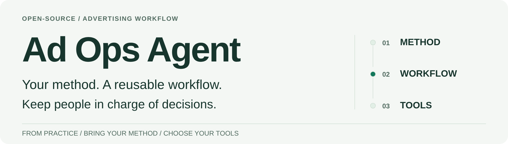
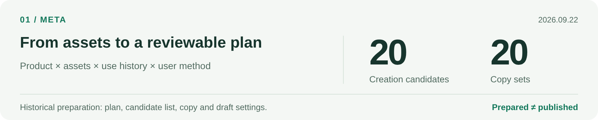
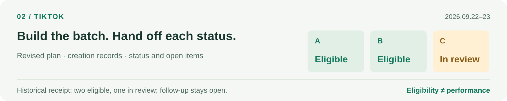
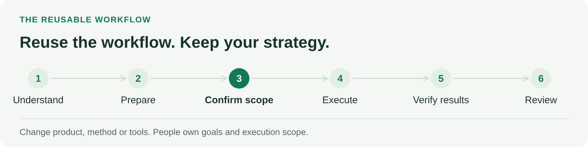

<picture>
  <source media="(max-width: 640px) and (prefers-color-scheme: dark)" srcset="docs/assets/showcase/hero.en.dark.narrow.png">
  <source media="(max-width: 640px)" srcset="docs/assets/showcase/hero.en.light.narrow.png">
  <source media="(prefers-color-scheme: dark)" srcset="docs/assets/showcase/hero.en.dark.wide.png">
  
</picture>

[Real work](#from-actual-advertising-work) · [Reusable workflow](#bring-your-method-reuse-the-workflow) · [Get started](#choose-a-starting-point) · [Documentation](docs/index.md) · [简体中文](README.zh-CN.md)

**An open-source AI workflow drawn from actual advertising work, reusable across products, methods and connection routes.**

It organizes creative selection, ad setup, data checks and result verification into a repeatable process. Bring your own product and method; you do not have to copy the maintainer's buying strategy.

> Real operations require connected, verified and authorized host tools. The public Python code provides offline demos and validation. [See the capability scope](docs/capability-status.md).

## From actual advertising work

<picture>
  <source media="(max-width: 640px) and (prefers-color-scheme: dark)" srcset="docs/assets/showcase/meta.en.dark.narrow.png">
  <source media="(max-width: 640px)" srcset="docs/assets/showcase/meta.en.light.narrow.png">
  <source media="(prefers-color-scheme: dark)" srcset="docs/assets/showcase/meta.en.dark.wide.png">
  
</picture>

**Meta · Preparation delivered.** Across two business lines, the task produced **20 ad-creation candidates and 20 individual copy sets**, with selection reasons, usage records and configuration drafts. The candidates were pending creation; the media buyer still had to review assets, budgets, attribution and the previous structure. [Full case →](docs/case-studies.md#meta-task)

<picture>
  <source media="(max-width: 640px) and (prefers-color-scheme: dark)" srcset="docs/assets/showcase/tiktok.en.dark.narrow.png">
  <source media="(max-width: 640px)" srcset="docs/assets/showcase/tiktok.en.light.narrow.png">
  <source media="(prefers-color-scheme: dark)" srcset="docs/assets/showcase/tiktok.en.dark.wide.png">
  
</picture>

**TikTok · Status handed off.** The task revised the plan, built ads and checked statuses object by object. Historical receipts recorded **two business lines eligible to deliver and one under review**, along with the previous-line handling and unresolved items. These statuses do not establish spend or performance. [Full case →](docs/case-studies.md#tiktok-task)

These images summarize anonymized historical tasks; they are not screenshots of an Agent interface. Meta: 2026-09-22; TikTok: 2026-09-22–23. Original private material is not public.

<details>
<summary><strong>Four more problems that became reusable checks</strong></summary>

| Actual problem | Workflow response |
| --- | --- |
| A creative file exists but may not fit the product | Check content, specs, usage history and method requirements separately |
| A report lacks a source or a rename shifts attribution | Mark data coverage and verify object relationships; missing is not zero |
| A receipt says enabled but readback disagrees | Hand off the observed state at the right time and preserve conflicts |
| A previous recommendation appears again | Check adoption, execution and configuration before evaluating results |

[All six cases and evidence boundaries](docs/case-studies.md) · [Meta rule diagnosis](docs/case-studies.md#meta-rule-check)
</details>

## Bring your method. Reuse the workflow.

<picture>
  <source media="(max-width: 640px) and (prefers-color-scheme: dark)" srcset="docs/assets/showcase/workflow.en.dark.narrow.png">
  <source media="(max-width: 640px)" srcset="docs/assets/showcase/workflow.en.light.narrow.png">
  <source media="(prefers-color-scheme: dark)" srcset="docs/assets/showcase/workflow.en.dark.wide.png">
  
</picture>

| What changes | What you define | What remains reusable |
| --- | --- | --- |
| Product and business | Web/App, events, revenue and quality definitions | Intake, preparation, review and verification |
| Buying method | Test question, constants, variables and observation rules | Plan versions, confirmation, records and review |
| Platform and tools | Native fields, permissions, object relationships and read capability | Business context, user methods and task workflow |

Newcomers can start with a few candidate methods; experienced buyers can bring their own SOP. The agent asks only for information missing from the current task and does not impose the maintainer's strategy.

[Host workflow](docs/workflow.md) · [Method confirmation](docs/method-planning.md) · [Capability matrix](docs/capability-status.md)

## Choose a starting point

**Already connected? Start a task.** Open the full repository in your Agent environment and confirm that [AGENTS.md](AGENTS.md) is loaded. Check the selected accounts, tools and authorization scope, then use the known product context and method. [First setup](docs/first-run.md) · [Loading and validation](docs/use-in-agent.md)

<details>
<summary><strong>Copy a read-only task to try the workflow</strong></summary>

Add the platform and accounts you want to inspect, then send this to the Agent after loading the project:

```text
Run a read-only advertising check for the platform and accounts I select.
First verify the account scope and available read tools. State which capabilities are missing.
Reuse known business context, confirmed methods and relevant open items; ask only for missing information.
Review the latest complete delivery day in each account's timezone. State the dates, timezones and data cutoff times.
Report data-quality issues, objects needing attention, suggestions and unresolved questions. Missing data is not zero.
Do not modify accounts, budgets or assets, and do not create or publish ads.
```
</details>

**Not connected? Set up tools first.** Existing MCP, API and SDK connections remain valid. See the [platform connection guide](docs/platform-connectivity.md) for self-managed and hosted routes.

**No account needed? Run the public example.** Requires Python 3.9+ and system IANA timezone data; standard library only.

```bash
git clone https://github.com/creator2000212-crypto/ad-ops-agent.git
cd ad-ops-agent
python3 demo/run_demo.py
```

The example checks **three fictional Meta accounts and ten ad sets**, producing analysis, proposed differences and snapshot comparisons. It makes no ad-platform calls and incurs no ad spend.

[Walkthrough](demo/README.md) · [Output report (Chinese)](demo/expected/report.md) · [More validation commands](docs/capability-status.md#offline-validation-entry-points)

## Explore further

| Your question | Start here |
| --- | --- |
| Business and methods | [Build from an example](docs/build-from-zero.md) · [Method and test planning](docs/method-planning.md) |
| Execution and checks | [Workflow](docs/workflow.md) · [Task record template](templates/task-record.md) |
| Knowledge and private experience | [Knowledge (Chinese)](docs/knowledge-base.zh-CN.md) · [Private methods (Chinese)](docs/private-memory.zh-CN.md) |
| Code and implementation scope | [Architecture](docs/architecture.md) · [Capabilities](docs/capability-status.md) · [Contributing](CONTRIBUTING.md) |

[Complete documentation index →](docs/index.md)

### Author and provenance

The maintainer organizes business methods, designs the Agent workflow and task specifications, develops and maintains the Python validation modules, and iterates from operational use. Host models provide understanding; host tools and external MCP, API or SDK connections provide platform operations.

[MIT](LICENSE). This project continues the workflow-building direction of `ads-ops-playbook` and retains its original notices. Original conversations, customer data, credentials, media and runtime databases are not distributed. [NOTICE](NOTICE.md) · [SECURITY](SECURITY.md)
