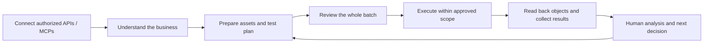

# Ad Ops Agent

**A provider-neutral foundation for advertising agents across Meta, TikTok and Google Ads.**

[简体中文](README.zh-CN.md) · [Documentation](docs/index.md) · [Roadmap](docs/roadmap.md) · [MIT license](LICENSE)

Let media buyers focus on understanding the business, interpreting results and deciding what to test next. Let an agent prepare assets, assemble configurations, build experiments, execute approved batches and explain what actually happened.

**Current release: an executable offline Python prototype plus a product and integration blueprint.** It does not connect to ad accounts, upload media, call an LLM, inspect images, publish ads or change budgets. The three platform names are simulation adapters using `generic_draft`; `native_payload` is always `null` and live mode is rejected. Design contracts are not loaded by the runtime.

## The intended workflow



Before operational work starts, the agent should understand the product, countries, languages, audience, target platforms, Web/App journey, IAA/IAP/hybrid monetization, measurement stack, creative direction and the team's testing methodology. Read what integrations can establish, ask focused questions for human decisions, preserve unknowns and reuse the resulting context.

The execution layer is replaceable: you can use official APIs, SDKs or MCP servers for each platform, or a managed connector. An API provides access to platform objects; an SDK wraps that API in code; an MCP server exposes supported operations as tools to an agent. None of them grants account access or publishing permission by itself. Native platform semantics remain in platform adapters.

**Pipeboard** is an optional managed connection layer for Meta, TikTok, Google Ads and other supported platforms. After you authorize selected ad accounts, its MCP connection lets a compatible assistant discover reporting tools and supported ad operations without building every platform transport yourself. See its [multi-platform MCP guide](https://pipeboard.co/guides/ads-mcp) and [Codex setup guide](https://pipeboard.co/guides/codex). If you want to get a connected AI workflow running sooner, visit the [Pipeboard website](https://pipeboard.co/#via=tian) to review its free and paid plans. Account authorization, plan limits and platform-specific capabilities still apply. Purchasing a connector does not turn this repository's offline prototype into a live publishing agent.

A practical starting point is to connect selected accounts with read-only access, inspect spend, conversions and status for a defined date range, then verify which asset and campaign tools are available for approved write workflows. The future agent layer in this repository will add business intake, cross-platform planning, batch review and native readback around those connections.

For a detailed, source-linked route through self-managed Meta, TikTok and Google Ads API / SDK / MCP access, see the [Chinese integration guide](docs/platform-connectivity.zh-CN.md).

## What runs today

| Capability | Implementation status |
|---|---|
| Business facts with source/status and conditional workflow dependencies | Offline JSON input and readiness evaluation |
| Web/App and monetization-dependent questions | Structured rules; no conversational LLM |
| Connection discovery, scope and freshness | Fictional snapshots only; no actual permission check |
| Asset selection | Explicit metadata filters and input order; no media inspection |
| Budget allocation and batch review | Decimal arithmetic, frozen plan hash, Markdown review |
| Contextual advertising knowledge | Runtime catalog retrieval, applicability/evidence/source review, intake and plan integration; advisory only |
| Execution and recovery | Local SQLite simulation, readback comparison, resume in the same state directory |
| Real Meta/TikTok/Google operations | Planned; not implemented |
| Additional operational recipes and design contracts | Human-readable guides and unloaded design JSON; separate from the runtime knowledge catalog |

The simulation authorization file is an unsigned test artifact, not authentication or a user's real publishing approval. Recovery is scoped to the same frozen plan and local state directory; it is not a distributed or cross-provider exactly-once guarantee.

## Quick start

Python 3.9+ with an IANA timezone database. The prototype uses the standard library; no advertising credentials or package installation are needed. Commands below assume a shell with `python3` (use your Python command on other systems).

```bash
git clone https://github.com/creator2000212-crypto/ad-ops-agent.git
cd ad-ops-agent
python3 scripts/demo.py
```

The demo writes a new, uniquely named directory under `runs/` and verifies:

1. A fresh fictional business profile and connection snapshot produce a ready context.
2. A frozen plan creates three local simulated drafts.
3. Resuming the same state creates no duplicates.
4. An intentionally interrupted write is reconciled before remaining operations continue.

It prints the output directory, `review.md` location and the expected object counts. All accounts and assets are fictional; fixture timestamps are refreshed only in a new copy. The demo never makes a network request.

Run the checks:

```bash
python3 -m unittest discover -s tests -v
python3 scripts/check_repository.py
```

## Use the individual CLI steps

Use a new output directory for each new frozen plan. For an existing run, resume it without rebuilding its source profile.

```bash
python3 onboarding.py --input examples/onboarding-learning.json --out runs/manual/profile.json --refresh-simulation-fixture
python3 onboarding.py --input runs/manual/profile.json --out runs/manual/context
python3 adops.py plan --brief examples/brief.json --candidates examples/candidates.json --context runs/manual/context/context.json --out runs/manual/plan
python3 adops.py authorize-simulation --plan runs/manual/plan/plan.json --out runs/manual/simulation-authorization.json
python3 adops.py execute --plan runs/manual/plan/plan.json --authorization runs/manual/simulation-authorization.json --state runs/manual/state
python3 adops.py resume --plan runs/manual/plan/plan.json --authorization runs/manual/simulation-authorization.json --state runs/manual/state
```

`authorize-simulation` does not approve real spending. Readiness checks return their state in JSON; a successful onboarding command can still report missing prerequisites. Plans and execution re-read the original business-profile source to detect drift. Unsupported native advertising settings are rejected rather than silently discarded.

For an incomplete App + hybrid monetization example, replace the onboarding input with `examples/onboarding-app-hybrid-discovery.json` and write to another output directory. It illustrates focused gaps and conflicting information, not a publish-ready setup.

## Operational knowledge included

- [Runtime knowledge base (Chinese)](docs/knowledge-base.zh-CN.md): source-linked knowledge with platform and business conditions, evidence gaps and review dates. `knowledge.py` supports deterministic search and assessment; onboarding and plan reviews use the same catalog without granting execution permissions.
- Sixteen [operation cards](docs/operations.md): media readiness, duplicate versus variant selection, existing posts, placement previews, tracking, parent status, copy defaults, budget ownership, concurrent human edits, timezone boundaries, attribution maturity, testing observations, Spark, RSA and ValueTrack.
- [Meta creative recovery](docs/meta-creative-recovery.md): separate local hashes, media references, creative IDs, ad IDs and post identities; distinguish technical repair, suspected false rejection and content revision.
- [Connector contract](contracts/connector-contract.json): native identity, capability/version records, normalization, uncertainty reconciliation and equivalent provider switching.
- [Google Ads API application guide (Chinese)](docs/google-ads-api-application.zh-CN.md): Cloud project setup, Test-to-production access upgrades, OAuth, brand verification and readback checks.
- [Experience catalog](contracts/experience-catalog.json) and [onboarding extensions](contracts/onboarding-extensions.json): reusable candidates with scope and evidence boundaries.
- [Acceptance scenarios](contracts/acceptance-scenarios.json): specifications for future implementation, separate from executable tests.

Try a knowledge lookup or an assessment using fictional observations:

```bash
python3 knowledge.py search --query '归因' --stage measurement --platform meta
python3 knowledge.py assess --profile examples/onboarding-learning.json --observations examples/knowledge-observations.json --stage diagnosis --out runs/knowledge-review
```

The assessment writes `report.json` and `review.md`. Results distinguish applicable knowledge from missing context, missing evidence and sources requiring review. They remain advisory: the engine does not fetch ad data, prove causes or execute recommendations. Catalog changes invalidate frozen plans, requiring a new plan review and simulation authorization.

## Repository map

```text
adops.py                 Offline plan, simulated authorization, execution and resume
onboarding.py            Structured business intake and readiness
knowledge.py             Deterministic knowledge search and advisory assessment
knowledge/               Runtime knowledge catalog with sources and conditions
examples/                Fictional JSON inputs
tests/                   Executable offline contract tests
scripts/                 Demonstration and repository checks
docs/                    Product, architecture, onboarding and operational guides
contracts/               Unloaded design contracts and candidate knowledge
.github/workflows/        Offline CI
```

See the [documentation index](docs/index.md) for a reading path and the [roadmap](docs/roadmap.md) for integration milestones. Contributions should preserve the distinction between observed evidence, proposed behavior and implemented functionality. Start with [CONTRIBUTING.md](CONTRIBUTING.md).

## License and provenance

MIT. This project develops the reusable workflow direction of `ads-ops-playbook`; its existing copyright notice is retained. Public examples are fictional. Private campaign records, credentials and generated execution state are not distributed. See [NOTICE.md](NOTICE.md) and [SECURITY.md](SECURITY.md).
