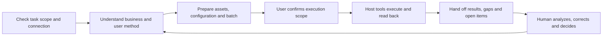

# Ad Ops Agent

### Let the agent handle ad operations. Keep media buyers focused on analysis and decisions.

**An open-source agent workflow distilled from advertising work carried out in an agent tool, designed for different businesses, methods and connection tools.**

The working practice includes creative selection, campaign preparation, account and configuration diagnosis, reporting, recurring reviews and retrospectives. This project organizes business context, method confirmation, tool use and result checks so other buyers can bring their own products and practices.

[简体中文](README.zh-CN.md) · [Cases from practice](docs/case-studies.md) · [Use the workflow](docs/workflow.md) · [Run the public demo](#run-the-public-demo-without-an-account) · [Documentation](docs/index.md)

> **Three distinct materials:** cases summarize anonymized historical records; the host workflow requires connected, verified tools for the task; public Python programs provide offline demonstrations and validation. A checkout does not grant ad-account access. [Full capability status](docs/capability-status.md)

## Take an advertising task through to handoff

A user might ask:

> “Prepare the next test from these videos using our confirmed product context and method. Show me the asset choices, configuration and budget first. After confirmation, proceed and tell me what completed and what still needs attention.”

The agent checks task accounts and tools, then reuses relevant business context. It checks assets against the destination, explains selection and exclusion, and prepares a batch. You choose the test direction and execution scope. After confirmation, the agent uses authorized host tools, reads actual configuration and separately hands off pending review, failures and unknown states.



The next review first establishes whether previous recommendations were executed and configuration took effect. **People own goals and direction. The agent organizes evidence, prepares plans and completes authorized operations.**

## What the working records taught us

These are anonymized summaries of reviewed historical material. They preserve the problem and its completion boundary. Original accounts, media, conversations and commercial figures remain private.

| Work encountered | How the buyer and agent collaborated | Reusable mechanism |
|---|---|---|
| A video batch contained mismatched content, technical limitations and reusable assets | The agent organized assets and exclusions; the buyer clarified product and test constraints | Check content, specifications, prior use and method fit separately |
| A TikTok multi-product plan needed revised creative sets and status checks | The user changed asset constraints; the agent adjusted the sets. Saved records showed some objects eligible and another in review | Hand off each object rather than declaring the whole batch live |
| A daily report lacked one platform's data | Retain available data and mark source gaps; the user supplies material or restores access | Missing is not zero, and stale data is not fresh retrieval |
| Renaming changed a report's business mapping | Trace structure, destination and rename history | Verify relationships; treat names as supporting labels |
| A receipt claimed activation while saved reads still showed paused or processing state | Inspect how the report was generated and preserve the conflict | Actual results must come from readback, not planned values |
| A recurring review encountered last round's problem again | Check adoption and execution before discussing the outcome | Separate unexecuted work, changes that did not take effect and immature outcomes |

[Read six cases and their evidence limits](docs/case-studies.md). The records establish use in actual tasks; they do not justify invented efficiency gains, advertising returns or a claim that every batch succeeded.

## One workflow for newcomers and experienced buyers

**A product owner new to advertising:** after connection setup, start with the product, market, conversion journey and budget boundary. The agent explains a few candidate methods, such as comparing two video openings or two content directions, and lets the user choose.

**A buyer with an established method:** bring the SOP, constraints and current goal. The agent extracts constants, variables, observation conditions and execution scope while preserving conflicts and unsupported requirements. Adopting the author's strategy is not required.

[Follow a concrete business and creative example](docs/build-from-zero.md) · [Organize and confirm methods](docs/method-planning.md)

## Reuse the workflow; choose your own strategy

| What changes | What to update | What remains reusable |
|---|---|---|
| Product, Web/App journey or monetization | Business facts, events, revenue and quality definitions | Intake, preparation, review and result checks |
| Test method | Question, constants, variables, budget and observation conditions | Plan versions, user confirmation, execution records and review |
| Platform or connection tool | Capabilities, native fields, object relationships, permissions and readback | Business context, user methods, tasks and historical evidence |

This describes workflow reuse, not complete implementation of every advertising product. Public Python supports two limited method templates. A host can discuss other methods; execution depends on available tools and a confirmed plan. Historical Meta/TikTok use is also distinguished from Google's design and simulation coverage. [Capability matrix](docs/capability-status.md)

## Use it in your agent environment

1. Open the full repository as a project and confirm that the host loads [AGENTS.md](AGENTS.md).
2. Check the task's platforms and accounts. Existing MCP, API or SDK connections remain valid. Read-only work needs the relevant reads; publishing also needs write and readback capabilities.
3. Describe your product, method and current task. Reuse known information before asking for gaps.
4. Follow the [host workflow](docs/workflow.md) and retain a [task record](templates/task-record.md) in a private directory.

With usable host tools and user authorization, real tasks can proceed through those tools without first converting the offline Python program into a production executor. Without a connection, follow the [connection guide](docs/platform-connectivity.md), covering self-managed and hosted routes including optional Pipeboard.

[First setup](docs/first-run.md) · [Loading and validation](docs/use-in-agent.md) · [Platform connections](docs/platform-connectivity.md)

## Run the public demo without an account

Requires Python 3.9+ and system IANA timezone data. Only the standard library is used.

```bash
git clone https://github.com/creator2000212-crypto/ad-ops-agent.git
cd ad-ops-agent
python3 demo/run_demo.py
```

The example reviews 3 fictional Meta accounts and 10 ad sets. Both a2 and a3 have no conversions: a2 has only 180 impressions and needs observation; a3 meets the example's sample and stop-loss conditions. A changed current budget holds up a9, while a6 remains open because the target differs from the preset later-state file.

[Full walkthrough](demo/README.md) · [Output report (Chinese)](demo/expected/report.md)

Additional examples:

```bash
python3 scripts/demo.py                 # Batch plans, simulated execution and recovery
python3 scripts/demo_private_memory.py  # Private record versions and conditional reuse
python3 scripts/demo_methods.py         # Six fictional inputs and method revisions
```

These commands make no live platform calls and incur no ad spend. Native platform execution, real approval and network calls are outside the current Python implementation. Simulation results cannot authorize host account operations. [Detailed scope and checks](docs/capability-status.md)

## What the project develops

- **Business and methods:** turn “follow my process” into sourced, scoped and revisable task conditions.
- **Execution workflow:** connect asset/configuration preparation with batch review, state checks, partial-failure recovery and the next review.
- **Shared knowledge and private experience:** share reusable checks while keeping product data and user methods private; confirm new observations before reuse.
- **Inspectable implementation:** use offline code to check inputs, plan consistency, method changes, recovery and records, then add integration evidence for specific live capabilities.

Models and connection tools supply understanding and operations. This project organizes advertising experience into a workflow that people can review, execute and trace. Historical practice does not automatically become everyone's strategy.

[Product design (Chinese)](docs/product.md) · [Architecture (Chinese)](docs/architecture.md) · [Knowledge base (Chinese)](docs/knowledge-base.zh-CN.md) · [Roadmap (Chinese)](docs/roadmap.md) · [Contributing](CONTRIBUTING.md)

## License and provenance

[MIT](LICENSE). The project develops the workflow-building direction of `ads-ops-playbook` and retains its original notices. Cases are anonymized summaries; original conversations, customer data, credentials, media and runtime databases are not distributed. [Provenance](NOTICE.md) · [Security](SECURITY.md)
