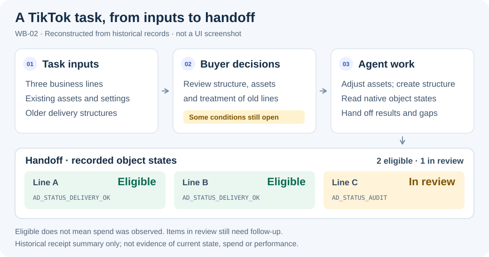

# Ad Ops Agent

### Let the agent handle ad operations. Keep media buyers focused on analysis and decisions.

**An open-source agent workflow distilled from advertising work carried out in an agent tool, designed for different businesses, methods and connection tools.**

The working practice includes creative selection, campaign preparation, account and configuration diagnosis, reporting, recurring reviews and retrospectives. This project organizes business context, method confirmation, tool use and result checks so other buyers can bring their own products and practices.

[简体中文](README.zh-CN.md) · [Cases from practice](docs/case-studies.md) · [Use the workflow](docs/workflow.md) · [Run the public demo](#run-the-public-demo-without-an-account) · [Documentation](docs/index.md)

> This project includes a workflow drawn from advertising practice and runnable offline examples. Real operations require connected, verified and authorized host tools. [Capability status](docs/capability-status.md)

## A real task: TikTok setup and handoff across three business lines

**Task:** Revise the campaign plan and creative sets for three business lines using existing assets and account settings, handle older structures and deliver an itemized status report.



**Delivery:** A revised plan, creation records, old-line pause results, per-object status and an unresolved-items list. The historical receipt records two lines as `AD_STATUS_DELIVERY_OK` (eligible) and one as `AD_STATUS_AUDIT` (in review). Follow-up still includes checking the review outcome and confirming settlement definitions, available account capacity and some creative rules.

The diagram is an anonymized reconstruction of September 22–23, 2026 records, not an agent UI screenshot. Eligibility does not establish spend or performance. [Read the full task, human decisions and evidence](docs/case-studies.md#tiktok-task)

**People choose goals, methods and execution scope. The agent organizes evidence, prepares plans, carries out authorized operations and checks results.** [Follow the reusable workflow](docs/workflow.md)

## What the working records taught us

These are anonymized summaries of reviewed historical material. They preserve the problem and its completion boundary. Original accounts, media, conversations and commercial figures remain private.

| Work encountered | How the buyer and agent collaborated | Reusable mechanism |
|---|---|---|
| A video batch contained mismatched content, technical limitations and reusable assets | The agent organized assets and exclusions; the buyer clarified product and test constraints | Check content, specifications, prior use and method fit separately |
| A report lacked platform data or renaming changed its business mapping | Mark source gaps and differences; trace structure, destination and rename history | Missing is not zero; names alone do not establish ownership |
| A receipt claimed activation while saved reads still showed paused or processing state | Inspect how the report was generated and preserve the conflict | Actual results must come from readback, not planned values |
| A recurring review encountered last round's problem again | Check adoption and execution before discussing the outcome | Separate unexecuted work, changes that did not take effect and immature outcomes |

[Read all six cases and their evidence](docs/case-studies.md).

## One workflow for newcomers and experienced buyers

**A product owner new to advertising:** after connection setup, start with the product, market, conversion journey and budget boundary. The agent explains a few candidate methods, such as comparing two video openings or two content directions, and lets the user choose.

**A buyer with an established method:** bring the SOP, constraints and current goal. The agent extracts constants, variables, observation conditions and execution scope while preserving conflicts and unsupported requirements. Adopting the author's strategy is not required.

[Follow a concrete business and creative example](docs/build-from-zero.md) · [Organize and confirm methods](docs/method-planning.md)

## Reuse the workflow; choose your own strategy

| What changes | What to update | What remains reusable |
|---|---|---|
| Product, Web/App journey or monetization | Business facts, events, revenue and quality definitions | Intake, preparation, review and result checks |
| Test method | Question, constants, variables, budget and observation conditions | Plan versions, user confirmation, execution records and review |
| Platform or connection tool | Capabilities, native fields, object relationships, permissions and readback | Business context, user methods, tasks and historical evidence |

See the [capability matrix](docs/capability-status.md) for platform coverage, host requirements and the public code's implementation scope.

## Use it in your agent environment

1. Open the full repository as a project and confirm that the host loads [AGENTS.md](AGENTS.md).
2. Check the task's platforms and accounts. Existing MCP, API or SDK connections remain valid. Read-only work needs the relevant reads; publishing also needs write and readback capabilities.
3. Describe your product, method and current task. Reuse known information before asking for gaps.
4. Follow the [host workflow](docs/workflow.md) and retain a [task record](templates/task-record.md) in a private directory.

For an optional first read-only task, copy this prompt and specify the platforms and accounts you want reviewed:

```text
Please run a read-only advertising review for my selected platforms and accounts.
First verify the account scope and available reading tools, and explain any missing access.
Reuse the business context, confirmed method and related open items already available; ask only for missing information.
Review the most recent complete advertising day in each account's own time zone. State the dates, time zones and data cutoff.
Report data-quality problems, objects needing attention, recommendations and unresolved questions. Keep missing data distinct from zero.
For this task, do not change accounts, budgets or creatives, or create or publish ads.
```

Without a connection, follow the [connection guide](docs/platform-connectivity.md), covering self-managed and hosted routes including optional Pipeboard.

[First setup](docs/first-run.md) · [Loading and validation](docs/use-in-agent.md) · [Platform connections](docs/platform-connectivity.md)

## Run the public demo without an account

Requires Python 3.9+ and system IANA timezone data. Only the standard library is used.

```bash
git clone https://github.com/creator2000212-crypto/ad-ops-agent.git
cd ad-ops-agent
python3 demo/run_demo.py
```

The example reviews 3 fictional Meta accounts and 10 ad sets. Both a2 and a3 have no conversions: a2 has only 180 impressions and needs observation; a3 meets the example's sample and stop-loss conditions. A changed current budget holds up a9, while a6 remains open because the target differs from the preset later-state file.

[Full walkthrough](demo/README.md) · [Output report (Chinese)](demo/expected/report.md)

Additional examples:

```bash
python3 scripts/demo.py                 # Batch plans, simulated execution and recovery
python3 scripts/demo_private_memory.py  # Private record versions and conditional reuse
python3 scripts/demo_methods.py         # Six fictional inputs and method revisions
```

These examples use fictional data, make no ad-platform calls, incur no ad spend and grant no live-operation authority. [Other validation entry points](docs/capability-status.md#offline-validation-entry-points)

## What the project develops

- **Business and methods:** turn “follow my process” into sourced, scoped and revisable task conditions.
- **Execution workflow:** connect asset/configuration preparation with batch review, state checks, partial-failure recovery and the next review.
- **Shared knowledge and private experience:** share reusable checks while keeping product data and user methods private; confirm new observations before reuse.
- **Inspectable implementation:** use offline code to check inputs, plan consistency, method changes, recovery and records, then add integration evidence for specific live capabilities.

Models and connection tools supply understanding and operations. This project organizes advertising experience into a workflow that people can review, execute and trace.

[Product design (Chinese)](docs/product.md) · [Architecture (Chinese)](docs/architecture.md) · [Knowledge base (Chinese)](docs/knowledge-base.zh-CN.md) · [Roadmap (Chinese)](docs/roadmap.md) · [Contributing](CONTRIBUTING.md)

## Author and project background

The maintainer organizes methods used in the business, designs the agent workflow and task specifications, develops and maintains the Python validation modules, and iterates on them using problems observed in actual work. Language-model understanding comes from the host's model; platform operations use its available tools and external MCP, API or SDK connections.

## License and provenance

[MIT](LICENSE). The project develops the workflow-building direction of `ads-ops-playbook` and retains its original notices. Cases are anonymized summaries; original conversations, customer data, credentials, media and runtime databases are not distributed. [Provenance](NOTICE.md) · [Security](SECURITY.md)
