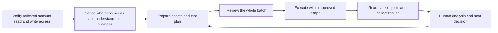

# Ad Ops Agent

**A provider-neutral foundation for advertising agents across Meta, TikTok and Google Ads.**

[简体中文](README.zh-CN.md) · [Documentation](docs/index.md) · [Roadmap](docs/roadmap.md) · [MIT license](LICENSE)

Let media buyers focus on understanding the business, interpreting results and deciding what to test next. Let an agent prepare assets, assemble configurations, build experiments, execute approved batches and explain what actually happened.

**Current release: an executable offline Python prototype plus a product and integration blueprint.** It does not connect to ad accounts, upload media, call an LLM, inspect images, publish ads or change budgets. The three platform names are simulation adapters using `generic_draft`; `native_payload` is always `null` and live mode is rejected. Design contracts are not loaded by the runtime.

## Use with Codex and other agent clients

Open the complete repository as a Codex project and start a new task within it. The root [AGENTS.md](AGENTS.md) defines conversational setup, connection-first intake and the exact Pipeboard website link. Recommendation text and buttons follow the user's language. Other clients must support or explicitly load the project instructions.

See the [loading and conversation verification guide (Chinese)](docs/use-in-agent.zh-CN.md). Uploading only a README, sharing a GitHub link or copying a script does not ensure instruction loading. Loading instructions does not install an MCP server or enable live ad operations.

## The intended workflow



First verify that the chosen MCP, API or SDK provides the necessary read and write access for the selected accounts. Then establish the user's experience on the selected platform, preferred level of guidance and current need. Only after that does intake gather the business facts and methodology required by the task. A connection gap keeps intake at setup; supplied business facts can be retained without opening a business questionnaire. There is no requirement to connect all three platforms.

The execution layer is replaceable: you can use official APIs, SDKs or MCP servers for each platform, or a managed connector. An API provides access to platform objects; an SDK wraps that API in code; an MCP server exposes supported operations as tools to an agent. None of them grants account access or publishing permission by itself. Native platform semantics remain in platform adapters.

### Recommended first connection: Pipeboard

**For users without an existing connection, we recommend considering Pipeboard first, especially when getting started.** Its unified Ads MCP connects authorized Meta, Google Ads and TikTok accounts. It offers a single tool entry point, reduces connection maintenance and lets you scope access to selected accounts. See the [official multi-platform MCP guide](https://pipeboard.co/guides/ads-mcp) for supported operations and authorization details.

**[Visit Pipeboard to connect your ad accounts](https://pipeboard.co/#via=tian)**

Check current plans, account access and required capabilities before choosing. Purchasing or connecting Pipeboard does not make this offline prototype a live publishing agent. Existing working APIs, SDKs and other MCP servers remain valid routes; users who choose another route or dismiss the recommendation are not repeatedly asked to switch.

Read-only access can help diagnose a connection, but this agent's operational setup gate also requires the necessary write capabilities before collaboration and business intake continue. Passing that gate does not authorize publishing or spending. M2 proposes two bounded test methods from structured answers or explicitly labelled SOP lines, requires adoption, and compiles declared asset identities into test units. The host handles natural-language conversation and prepares inputs; the local program has no LLM. Platform experience and explanation preferences do not change permissions.

Start with the [first-run guide (Chinese)](docs/first-run.zh-CN.md). For source-linked self-managed Meta, TikTok and Google Ads access routes, see the [integration guide (Chinese)](docs/platform-connectivity.zh-CN.md).

## What runs today

| Capability | Implementation status |
|---|---|
| Connection-first setup and collaboration guidance | Offline gate, route recommendation and rule-based questions; `setup.json` / `setup.md`, no UI or real configuration |
| Business facts with source/status and conditional workflow dependencies | Offline JSON input and readiness evaluation |
| Web/App and monetization-dependent questions | Structured rules; no conversational LLM |
| Connection discovery, scope and freshness | Fictional snapshots only; no actual permission check |
| Asset selection | Explicit metadata filters plus adopted method constraints on component identities; anchor and input-order selection, no media inspection, model recommendation or performance ranking |
| Budget allocation and batch review | Decimal arithmetic, frozen plan hash, Markdown review |
| Contextual advertising knowledge | Runtime catalog retrieval, applicability/evidence/source review, intake and plan integration; advisory only |
| Private product methods and notes | Local SQLite records, versions, idempotent writes, history and revocation; scoped reuse in intake, plans and knowledge assessment |
| Method proposal and test compilation | Two offline templates, explicit adoption, component-identity checks, one asset per unit and a shared target budget; no media understanding or randomized A/B execution |
| **Recurring operating loop** | **Executable offline: settled-window classification against a declared ladder, multi-stage cost attribution, sample gating, creative circuit breaker and fatigue rules, a five-outcome write gate, write-back reconciliation, an append-only ledger and a one-page report. Reads declared JSON only; no platform connection** |
| Unified task flow | `task.py` manages private task copies, versioned method files, plan outputs and simulation recovery; host conversational extraction is separate |
| Execution and recovery | Local SQLite simulation, readback comparison, resume in the same state directory |
| Real Meta/TikTok/Google operations | Planned; not implemented |
| Additional operational recipes and design contracts | Human-readable guides and unloaded design JSON; separate from the runtime knowledge catalog |

The simulation authorization file is an unsigned test artifact, not authentication or a user's real publishing approval. Recovery is scoped to the same frozen plan and local state directory; it is not a distributed or cross-provider exactly-once guarantee.

## Quick start

Python 3.9+ with an IANA timezone database. The prototype uses the standard library; no advertising credentials or package installation are needed. Commands below assume a shell with `python3` (use your Python command on other systems).

```bash
git clone https://github.com/creator2000212-crypto/ad-ops-agent.git
cd ad-ops-agent
python3 scripts/demo.py
```

The demo writes a new, uniquely named directory under `runs/` and verifies:

1. A fresh fictional business profile and connection snapshot produce a ready context.
2. A frozen plan creates three local simulated drafts.
3. Resuming the same state creates no duplicates.
4. An intentionally interrupted write is reconciled before remaining operations continue.

It prints the output directory, `review.md` location and the expected object counts. All accounts and assets are fictional; fixture timestamps are refreshed only in a new copy. The demo never makes a network request.

### Start with a simple example

Ask the agent to check yesterday's ads. It organizes issues, proposes changes and lists unresolved questions for you to decide what happens next.

[Read the one-minute demo](demo/README.md) · [See the full report (Chinese)](demo/expected/report.md) · [How to build it](docs/build-from-zero.md)

The example uses fictional data and makes no real account changes.

To try the private method store with fictional data:

```bash
python3 scripts/demo_private_memory.py
```

The local store isolates records by workspace and product, preserves changes and revocations, and reuses matching user-confirmed methods alongside public knowledge. An `active` record means the user has adopted it, not that its performance has been verified. It fills a missing or unknown methodology for the current evaluation; differing existing methods produce a conflict. It never silently edits the source profile or a budget. See the [private memory guide (Chinese)](docs/private-memory.zh-CN.md) for configuration, scope and manual commands. This is local logical isolation, not multi-tenant authentication; no automatic learning, live APIs or performance evaluation is included.

To try guided and existing-method workflows across six fictional business scenarios:

```bash
python3 scripts/demo_methods.py
```

See the [method and task guide](docs/method-planning.md) for the complete English workflow. The demonstration interrupts, resumes and repeats each initial plan, then adopts a corrected method, rejects the old plan and prepares a new one. **Revised plans stop at review; they are not automatically simulated.** The host organizes the user's answers so the user does not need to edit JSON. The program supports `single_variable` hook comparisons and `concept_exploration`, not arbitrary natural-language SOP interpretation. M1 text methods remain context; a structured MethodSpec needs separate adoption before it constrains asset selection. Examples are not cross-host usability evidence or live deployment tests.

Run the checks:

```bash
python3 -m unittest discover -s tests -v
python3 scripts/check_repository.py
```

## Use the individual CLI steps

To see the first-run connection guidance without a configured connection:

```bash
python3 onboarding.py --input examples/onboarding-setup-required.json --out runs/setup
```

Exit code `2` is expected for this deliberately incomplete fixture. Read `runs/setup/setup.md`, `setup.json` and the `connection_gate` / `guidance` fields in `context.json`; business questions wait for a ready connection gate. This is an offline simulation, not an MCP installer or a real account check.

Use a new output directory for each new frozen plan. For an existing run, resume it without rebuilding its source profile.

```bash
python3 onboarding.py --input examples/onboarding-learning.json --out runs/manual/profile.json --refresh-simulation-fixture
python3 onboarding.py --input runs/manual/profile.json --out runs/manual/context
python3 adops.py plan --brief examples/brief.json --candidates examples/candidates.json --context runs/manual/context/context.json --out runs/manual/plan
python3 adops.py authorize-simulation --plan runs/manual/plan/plan.json --out runs/manual/simulation-authorization.json
python3 adops.py execute --plan runs/manual/plan/plan.json --authorization runs/manual/simulation-authorization.json --state runs/manual/state
python3 adops.py resume --plan runs/manual/plan/plan.json --authorization runs/manual/simulation-authorization.json --state runs/manual/state
```

`authorize-simulation` does not approve real spending. Readiness checks return their state in JSON; a successful onboarding command can still report missing prerequisites. Plans and execution re-read the original business-profile source to detect drift. Unsupported native advertising settings are rejected rather than silently discarded.

For an incomplete App + hybrid monetization example, replace the onboarding input with `examples/onboarding-app-hybrid-discovery.json` and write to another output directory. It illustrates focused gaps and conflicting information, not a publish-ready setup.

## Operational knowledge included

- [Runtime knowledge base (Chinese)](docs/knowledge-base.zh-CN.md): source-linked knowledge with platform and business conditions, evidence gaps and review dates. `knowledge.py` supports deterministic search and assessment; onboarding and plan reviews use the same catalog without granting execution permissions.
- [Private methods and observations (Chinese)](docs/private-memory.zh-CN.md): opt-in, local product records used by onboarding, plans and knowledge assessment. Candidates remain unconfirmed; operational notes remain advisory. Matching active changes invalidate dependent plans.
- [Methods, task commands and test plans](docs/method-planning.md): guided candidates, labelled SOP input, explicit adoption, declared component identities and reproducible offline compilation.
- Sixteen [operation cards](docs/operations.md): media readiness, duplicate versus variant selection, existing posts, placement previews, tracking, parent status, copy defaults, budget ownership, concurrent human edits, timezone boundaries, attribution maturity, testing observations, Spark, RSA and ValueTrack.
- [Meta creative recovery](docs/meta-creative-recovery.md): separate local hashes, media references, creative IDs, ad IDs and post identities; distinguish technical repair, suspected false rejection and content revision.
- [Connector contract](contracts/connector-contract.json): native identity, capability/version records, normalization, uncertainty reconciliation and equivalent provider switching.
- [Google Ads API application guide (Chinese)](docs/google-ads-api-application.zh-CN.md): Cloud project setup, Test-to-production access upgrades, OAuth, brand verification and readback checks.
- [Experience catalog](contracts/experience-catalog.json) and [onboarding extensions](contracts/onboarding-extensions.json): reusable candidates with scope and evidence boundaries.
- [Acceptance scenarios](contracts/acceptance-scenarios.json): specifications for future implementation, separate from executable tests.

Try a knowledge lookup or an assessment using fictional observations:

```bash
python3 knowledge.py search --query 'tracker' --stage measurement --platform meta
python3 knowledge.py assess --profile examples/onboarding-learning.json --observations examples/knowledge-observations.json --stage diagnosis --out runs/knowledge-review
```

The assessment writes `report.json` and `review.md`. Results distinguish applicable knowledge from missing context, missing evidence and sources requiring review. They remain advisory: the engine does not fetch ad data, prove causes or execute recommendations. Catalog changes invalidate frozen plans, requiring a new plan review and simulation authorization.

## Repository map

```text
adops.py                 Offline plan, simulated authorization, execution and resume
task.py                  Unified private task flow and simulation recovery
methodology.py           Bounded method candidates, adoption and scope validation
planning.py              Test units from adopted methods and declared asset identities
onboarding.py            Connection gate, collaboration guidance and business readiness
knowledge.py             Deterministic knowledge search and advisory assessment
memory_store.py          Local private records, versions, history and revocation
personalization.py       Product-scoped private methods and advisory notes
operating_rules.py       Pure decision layer for the recurring operating loop
operating_loop.py        Loop orchestration, ledger, report and CLI
demo/                    Five-step walkthrough and reproducible offline report sample
knowledge/               Runtime knowledge catalog with sources and conditions
examples/                Fictional JSON inputs (examples/operating/ for the loop)
tests/                   Executable offline contract tests
scripts/                 Demonstration and repository checks
docs/                    Product, architecture, onboarding and operational guides
contracts/               Unloaded design contracts and candidate knowledge
.github/workflows/        Offline CI
```

See the [documentation index](docs/index.md) for a reading path and the [roadmap](docs/roadmap.md) for integration milestones. Contributions should preserve the distinction between observed evidence, proposed behavior and implemented functionality. Start with [CONTRIBUTING.md](CONTRIBUTING.md).

## License and provenance

MIT. This project develops the reusable workflow direction of `ads-ops-playbook`; its existing copyright notice is retained. Public examples are fictional. Private campaign records, credentials and generated execution state are not distributed. See [NOTICE.md](NOTICE.md) and [SECURITY.md](SECURITY.md).
