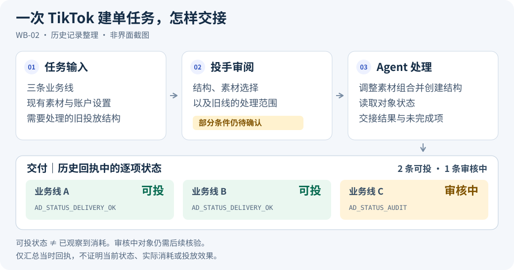

# Ad Ops Agent

### 让 Agent 处理投放操作，让投手专注分析与决策。

**从 Agent 工具中实际使用的投放工作流，提炼面向不同业务、不同方法和不同接入方式的开源 Agent。**

实际工作涉及素材筛选、广告搭建、账户与配置排查、日报对账、周期巡检和复盘。本项目把这些工作中的业务理解、方法确认、工具协作和结果核对组织成可复用流程，让其他投手带着自己的产品和方法开始使用。

[English](README.md) · [看真实工作案例](docs/case-studies.zh-CN.md) · [使用工作流](docs/workflow.zh-CN.md) · [运行公开示例](#无需账户先运行公开示例) · [文档导航](docs/index.md)

> 本项目包含源于实际业务的 Agent 工作流与可运行的离线示例；真实操作依赖已连接、已验证并获授权的宿主工具。[能力范围](docs/capability-status.zh-CN.md)

## 一次真实任务：三条业务线的 TikTok 搭建与交接

**任务：**根据已有素材和账户配置，调整三条业务线的投放方案与素材组合，处理旧结构，并交付逐项状态。



**交付：**修订方案、建单记录、旧线暂停结果、逐对象状态和待确认清单。历史回执记录两条业务线为 `AD_STATUS_DELIVERY_OK`（可投），一条为 `AD_STATUS_AUDIT`（审核中）；后续仍需检查待审对象，并确认结算口径、可用额度和部分素材规则。

图按 2026-09-22—23 的历史记录脱敏整理，并非 Agent 界面截图；可投状态不代表已产生消耗或效果。[查看完整任务、人的决策与证据](docs/case-studies.zh-CN.md#tiktok-task)

**人决定目标、方法与执行范围；Agent 整理依据、准备方案、执行获准操作并核对结果。**[查看可复用工作流](docs/workflow.zh-CN.md)

## 从实际工作里提炼了什么

以下是历史材料复核后的脱敏摘要。它们保留实际问题和完成边界，原始账户、素材、对话与商业数据不公开。

| 实际遇到的工作 | Agent 与投手怎样协作 | 沉淀到公共流程的机制 |
|---|---|---|
| 一批视频里有内容不符、技术条件不足和可复用素材 | Agent 整理素材及排除理由，投手补充产品和测试条件 | 内容、规格、历史使用和方法要求分别检查 |
| 日报缺少平台数据，或改名造成业务归属漂移 | 标明缺失与来源差异，结合结构、目的地和改名记录追查 | 缺数不写成零，归属不只看名称 |
| 回执写着启用，独立保存的状态却还在暂停或处理中 | 复核生成方式与读取记录，保留证据冲突 | 实际结果必须来自读回，不能从计划值生成 |
| 周期巡检又看到上一轮的问题 | 先查建议是否被采用、动作是否执行，再讨论结果 | 未执行、执行未生效、效果尚待观察分别记录 |

[查看全部六个案例及证据](docs/case-studies.zh-CN.md)。

## 新手和熟手，使用同一套工作流

**有产品但不懂投放：**接入完成后，从产品、市场、转化方式和资金边界开始。Agent 解释少量候选方法，例如比较两个视频开头或两种内容方向；说明各自能回答什么，再由用户选择。

**已有成熟方法：**提供现有 SOP、约束和本轮目标。Agent 提取固定项、变化项、观察条件和执行范围，保留冲突与不支持项；不要求使用者改用作者的投法。

[看一个从业务到选材的具体例子](docs/build-from-zero.zh-CN.md) · [方法怎样组织与确认](docs/method-planning.zh-CN.md)

## 通用的是流程，具体投法由用户决定

| 你要更换什么 | 需要更新什么 | 可以继续复用什么 |
|---|---|---|
| 产品、Web/App 或变现方式 | 业务资料、事件、收入与质量口径 | 需求整理、准备、审阅、结果核对 |
| 测试方法 | 测试问题、固定项、变量、预算与观察条件 | 方案版本、用户确认、执行记录与复盘 |
| 平台或连接工具 | 所需能力、原生字段、对象关系、权限与读回验证 | 业务资料、用户方法、任务与历史证据 |

平台覆盖、宿主使用条件与公开代码的实现范围见[能力矩阵](docs/capability-status.zh-CN.md)。

## 放进自己的 Agent 环境

1. 将完整仓库作为项目打开，确认宿主加载了 [AGENTS.md](AGENTS.md)。
2. 检查本次平台与账户的连接。已有 MCP、API 或 SDK 可以继续使用；只读任务先验证所需读取能力，发布任务还需写入和读回能力。
3. 说明产品、已有方法和当前任务。Agent 先复用已知信息，再问缺项。
4. 按[宿主工作流](docs/workflow.zh-CN.md)形成方案与交接，用[任务模板](templates/task-record.zh-CN.md)在私有目录保留记录。

尚未接入时，先完成[接入指南](docs/platform-connectivity.zh-CN.md)；其中介绍自建和托管连接方式，包括可选的 Pipeboard。

[首次配置](docs/first-run.zh-CN.md) · [加载与验收](docs/use-in-agent.zh-CN.md) · [平台接入](docs/platform-connectivity.zh-CN.md)

## 无需账户，先运行公开示例

需要 Python 3.9+ 与系统 IANA 时区数据库；只使用标准库。

```bash
git clone https://github.com/creator2000212-crypto/ad-ops-agent.git
cd ad-ops-agent
python3 demo/run_demo.py
```

示例检查虚构的 3 个 Meta 账户、10 个广告组。例如，同样是零转化，a2 只有 180 次展示，先观察；a3 达到本例的样本和止损条件，提出暂停复核；a9 当前预算与原记录不同，先查差异；a6 的目标预算与预设结果文件不一致，保留待办。

[看完整示例](demo/README.zh-CN.md) · [看输出报告](demo/expected/report.md)

还可以运行：

```bash
python3 scripts/demo.py                 # 批次计划、模拟执行和恢复
python3 scripts/demo_private_memory.py  # 私有经验的版本与条件复用
python3 scripts/demo_methods.py         # 六个虚构业务输入与方法修订
```

这些示例使用虚构数据，不调用广告平台、不产生广告消耗，也不授予真实操作权限。[其他验证入口](docs/capability-status.zh-CN.md#离线验证入口)

## 这个项目持续沉淀什么

- **业务与方法：**把“按我的方式做”转成有来源、有适用范围、可修订的任务条件。
- **执行流程：**从素材与配置准备，到整批确认、状态核对、部分失败恢复和下轮回验。
- **公共知识与私有经验：**通用检查可共享，产品数据和用户方法留在各自环境；新观察经用户确认后再复用。
- **可检查的实现：**用离线代码验证输入、计划一致性、方法变更、恢复和记录逻辑，再为明确需要的真实能力补集成证据。

模型和连接工具提供理解与操作能力；项目的工作是把投放经验组织为可审阅、可执行、可追溯的协作流程。

[产品设计](docs/product.md) · [架构](docs/architecture.md) · [知识库](docs/knowledge-base.zh-CN.md) · [开发路线](docs/roadmap.md) · [贡献说明](CONTRIBUTING.md)

## 许可证与来源

[MIT](LICENSE)。项目延续 `ads-ops-playbook` 的工作流搭建方向，保留原有版权与来源说明。历史案例仅公开匿名整理，原始对话、客户数据、凭据、媒体与运行数据库不随仓库发布。[来源说明](NOTICE.md) · [安全说明](SECURITY.md)
