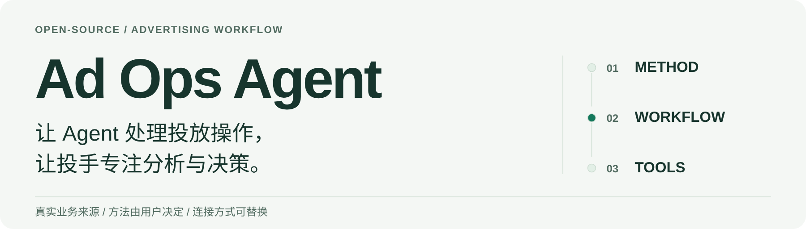
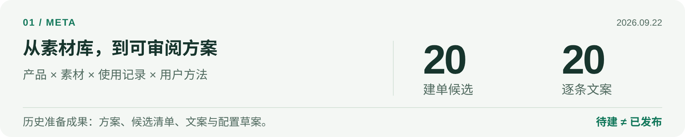
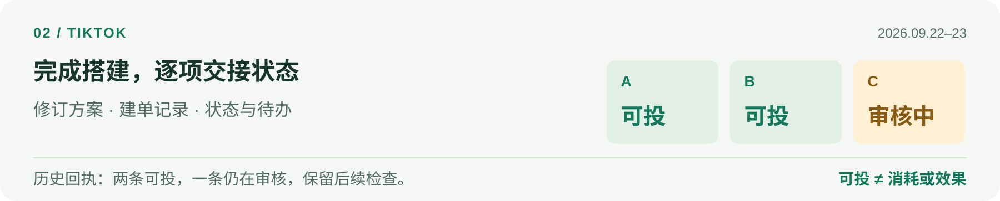
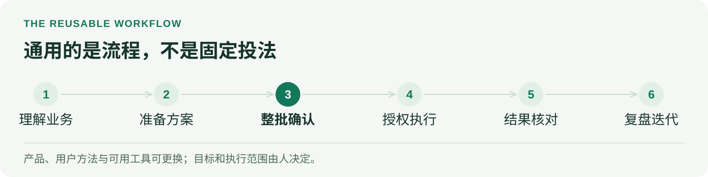

# Ad Ops Agent

<picture>
  <source media="(max-width: 640px) and (prefers-color-scheme: dark)" srcset="docs/assets/showcase/hero.zh-CN.dark.narrow.png">
  <source media="(max-width: 640px)" srcset="docs/assets/showcase/hero.zh-CN.light.narrow.png">
  <source media="(prefers-color-scheme: dark)" srcset="docs/assets/showcase/hero.zh-CN.dark.wide.png">
  
</picture>

[真实案例](#从实际工作中来) · [通用工作流](#带上你的方法复用这套流程) · [开始使用](#选一个起点) · [文档导航](docs/index.md) · [English](README.md)

**源于真实投放业务，面向不同产品、投放方法与接入方式复用的开源 AI 工作流。**

将素材筛选、广告搭建、数据巡检与结果核对组织成可复用流程。使用者带着自己的产品和方法开始，而不是照搬作者的固定投法。

> 真实操作依赖已连接、已验证并获授权的宿主工具；公开 Python 提供离线演示与验证。[查看能力范围](docs/capability-status.zh-CN.md)。

## 从实际工作中来

<picture>
  <source media="(max-width: 640px) and (prefers-color-scheme: dark)" srcset="docs/assets/showcase/meta.zh-CN.dark.narrow.png">
  <source media="(max-width: 640px)" srcset="docs/assets/showcase/meta.zh-CN.light.narrow.png">
  <source media="(prefers-color-scheme: dark)" srcset="docs/assets/showcase/meta.zh-CN.dark.wide.png">
  
</picture>

**Meta · 准备成果。** 两条业务线，交付 **20 条建单候选与 20 套逐条文案**，附选材理由、使用记录和配置草案。状态为待建；素材、预算、归因和旧结构处理由投手审阅。[完整案例 →](docs/case-studies.zh-CN.md#meta-task)

<picture>
  <source media="(max-width: 640px) and (prefers-color-scheme: dark)" srcset="docs/assets/showcase/tiktok.zh-CN.dark.narrow.png">
  <source media="(max-width: 640px)" srcset="docs/assets/showcase/tiktok.zh-CN.light.narrow.png">
  <source media="(prefers-color-scheme: dark)" srcset="docs/assets/showcase/tiktok.zh-CN.dark.wide.png">
  
</picture>

**TikTok · 状态交接。** 修订方案、建单并逐项核对状态。历史回执记录 **2 条业务线可投、1 条审核中**，保留旧线处理结果及待确认项；不据此推断消耗或效果。[完整案例 →](docs/case-studies.zh-CN.md#tiktok-task)

以上为历史任务的脱敏整理图，不是 Agent 界面截图。Meta：2026-09-22；TikTok：2026-09-22—23。原始私有资料不公开。

<details>
<summary><strong>另外四类问题，怎样变成可复用的检查</strong></summary>

| 实际问题 | 工作流中的处理 |
| --- | --- |
| 素材文件存在，但不一定匹配产品 | 分别检查内容、规格、使用历史和方法要求 |
| 报表缺源或改名导致归属漂移 | 标注数据覆盖；用对象关系核对，不把缺数写成零 |
| 回执写着启用，但读取状态不一致 | 依据对应时点的实际读取交接，保留未知与冲突 |
| 上一轮建议再次出现 | 先核对采用、执行与生效情况，再评价后续结果 |

[六个案例及证据范围](docs/case-studies.zh-CN.md) · [Meta 规则排查](docs/case-studies.zh-CN.md#meta-rule-check)
</details>

## 带上你的方法，复用这套流程

<picture>
  <source media="(max-width: 640px) and (prefers-color-scheme: dark)" srcset="docs/assets/showcase/workflow.zh-CN.dark.narrow.png">
  <source media="(max-width: 640px)" srcset="docs/assets/showcase/workflow.zh-CN.light.narrow.png">
  <source media="(prefers-color-scheme: dark)" srcset="docs/assets/showcase/workflow.zh-CN.dark.wide.png">
  
</picture>

| 更换什么 | 使用者定义什么 | 继续复用什么 |
| --- | --- | --- |
| 产品与业务 | Web/App、事件、收入与质量口径 | 需求整理、准备、审阅和核对 |
| 投放方法 | 测试问题、固定项、变量与观察条件 | 方案版本、确认、记录与复盘 |
| 平台与工具 | 原生字段、权限、对象关系与读取能力 | 业务资料、用户方法与任务流程 |

新手可以从候选方法开始；熟手可以带入自己的 SOP。Agent 只补与本次任务有关的缺项，不强制采用作者的策略。

**已有连接工具，为什么还需要这个项目？** 模型与连接工具提供账户读取和操作能力；Ad Ops Agent 把这些能力组织成一项投放任务：沿用产品资料与用户方法，整理素材和方案，核对预算与操作范围，并将执行、读回和下一轮复盘接起来。讨论“能不能改预算”之前，先明确**按谁的方法、针对哪些对象、观察哪个时间窗口、改后怎样核对**。

[同一套工作流，两种不同投放方法（虚构示例）](docs/method-comparison.zh-CN.md) · [工作流说明](docs/workflow.zh-CN.md) · [方法确认](docs/method-planning.zh-CN.md) · [能力矩阵](docs/capability-status.zh-CN.md)

## 选一个起点

**已有连接，开始一项任务。** 在 Agent 环境打开完整仓库，确认加载 [AGENTS.md](AGENTS.md)；核对本次账户、工具及授权范围，沿用已确认的产品与方法。[首次配置](docs/first-run.zh-CN.md) · [加载与验收](docs/use-in-agent.zh-CN.md)

<details>
<summary><strong>复制一条只读任务，作为第一次体验</strong></summary>

补充需要检查的平台和账户后，将下列内容发给已加载项目的 Agent：

```text
请对我选定的平台和账户做一次只读投放检查。
先核对账户范围与本次可用的读取工具，具体说明缺少哪些访问能力。
沿用已有业务资料、已确认方法和相关待办，只问缺失的信息。
查看最近一个完整投放日，以各账户自己的时区为准，注明日期、时区和数据截至时间。
输出数据质量问题、需要关注的对象、建议和待确认项；缺失数据不要写成零。
本次暂不修改账户、预算或素材，也不创建或发布广告。
```
</details>

第一次交付是一份只读检查结果：写清所选账户的覆盖范围、数据截至时间、缺少的能力或数据源、待看对象与待确认项；不会修改广告账户。

**尚未接入，先配置工具。** 可继续使用已有 MCP、API 或 SDK；自建与托管方案见[平台接入指南](docs/platform-connectivity.zh-CN.md)。

**不接账户，先运行公开示例。** 需要 Python 3.9+ 与系统 IANA 时区数据；仅用标准库。

```bash
git clone https://github.com/creator2000212-crypto/ad-ops-agent.git
cd ad-ops-agent
python3 demo/run_demo.py
```

示例检查虚构的 **3 个 Meta 账户、10 个广告组**，输出分析、待审差异与快照对照。不连接广告平台，不产生广告消耗。

[示例说明](demo/README.zh-CN.md) · [输出报告](demo/expected/report.md) · [更多验证命令](docs/capability-status.zh-CN.md#离线验证入口)

## 继续深入

| 你关心什么 | 从这里阅读 |
| --- | --- |
| 业务与方法 | [具体搭建例子](docs/build-from-zero.zh-CN.md) · [方法与测试计划](docs/method-planning.zh-CN.md) |
| 执行与核对 | [工作流](docs/workflow.zh-CN.md) · [任务记录模板](templates/task-record.zh-CN.md) |
| 知识与私有经验 | [知识库](docs/knowledge-base.zh-CN.md) · [产品私有方法库](docs/private-memory.zh-CN.md) |
| 代码与实现范围 | [架构](docs/architecture.md) · [能力矩阵](docs/capability-status.zh-CN.md) · [贡献](CONTRIBUTING.md) |

[完整文档导航 →](docs/index.md)

### 作者与项目来源

维护者负责业务方法梳理、Agent 工作流与任务规范设计、Python 验证模块开发维护及业务迭代。模型理解由宿主模型提供；平台操作通过宿主工具和外部 MCP、API 或 SDK 完成。

[MIT](LICENSE)。项目延续 `ads-ops-playbook` 的工作流方向并保留原有来源说明。原始对话、客户数据、凭据、媒体与运行数据库不随仓库发布。[NOTICE](NOTICE.md) · [SECURITY](SECURITY.md)
