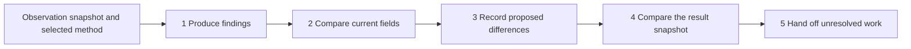

# One operating round: from observations to a useful handoff

[简体中文](README.zh-CN.md) · [Project home](../README.md) · [How to build the workflow](../docs/build-from-zero.md)

This demo shows a complete division of work: **the operator sets the goal and adopts a method; the agent organizes evidence, proposes changes, checks their conditions and returns results with unresolved work.**

The workflow draws on the maintainer's advertising work with other agents. This public example reproduces the pattern with **fictional accounts and supplied snapshots**. It is not a raw production log and makes no advertising-platform calls.

| What would you like to see? | Start here |
|---|---|
| How a routine round works | Follow the five steps below |
| The output without running anything | [Generated report (Chinese)](expected/report.md) · [Machine-readable summary](expected/summary.json) |
| A local reproduction | Run `python3 demo/run_demo.py --steps` from the repository root |
| Module design and method development | [From operating work to a reusable agent](../docs/build-from-zero.md) |

## Who does what

The operator owns business goals, method selection, budget boundaries and the decision to adopt a recommendation. The agent organizes evidence under those conditions, prepares field differences, compares results and preserves records.

In a live workflow, publishing or changing an account also requires authorization, platform calls and independent readback. This demo covers the reproducible offline portion: reading files, applying declared rules, comparing fields, recording events and producing a report. `ready` means a field comparison passed; it does not mean a user authorized a change.



A live connector would operate only after review and authorization. Step 3 here records a plan; step 4 reads an independently supplied result file.

## Inputs for this round

The scenario is an inspection of existing delivery: which objects warrant attention, and which need more evidence? Connection setup and the business interview precede this round. Scope and methods should already be established through the [first-run process (Chinese)](../docs/first-run.zh-CN.md).

| Input | This example | Purpose |
|---|---|---|
| Observation snapshot | 3 fictional Meta accounts, with 10 ad sets in total; account C has no ad set records | Preserve account state and ad set metrics |
| Time basis | Snapshot cutoff: 2026-09-24 11:50 UTC+8; ad set observation window: the full delivery day of September 23 | Identify the period represented by each metric |
| Method document | `reference-1n1-ladder`, including target ROAS, sample conditions, budget stages and stop-loss rules | Supply explicit criteria for this round |
| Pre-change snapshot | Fields read before a proposed adjustment | Detect targets already satisfied, changed values and missing fields |
| Post-change snapshot | Independently supplied example fields | Demonstrate matching and mismatching target values |
| Settlement table | A separate revenue and cost example | Present the settlement basis alongside operational findings without treating both as one current dataset |

Files live in [`examples/operating/`](../examples/operating/). Account health uses the snapshot's `today_spend`; ad set rules use the declared observation window; settlement has its own date. Do not add these together as if they were one live table.

The **85% ROAS, 1n1 structure, T-based stages, 3T stop loss and impression threshold belong to this example method**. They are not universal defaults. T is the target cost per result calculated by this method; it does not replace the goals of every app, ecommerce or lead-generation business.

## Five steps through a round

### 1. Produce findings with evidence and open questions

**Input:** observation snapshot and method. **Agent work:** calculate available metrics and inspect account health, creative signals and ad set conditions. **Output:** `findings.json`, with 16 findings across 12 rule codes.

Those findings span account, ad set and creative levels. They are not 16 ad sets or 16 operations. One ad set can receive both a creative warning and a budget recommendation; the operator still needs to interpret that combination.

Three objects illustrate the distinction. Short IDs below omit the `fictional-adset-` prefix.

| Object | Observation | Result under this method |
|---|---|---|
| `a2` | Spend 3.10, 180 impressions, 0 conversions | Insufficient sample; retain uncertainty rather than declaring the creative ineffective |
| `a3` | Spend 15.30, 420 impressions, 0 conversions | Meets the example's zero-conversion stop-loss conditions; propose pausing |
| `a5` | CPA 1.60, but only 32% budget utilization | Investigate limited delivery before treating a low CPA as a reason to increase budget |

Account and creative checks can produce parallel findings; the main ad set classification has its own order. The whole system is not a seven-gate chain that picks one winning conclusion. Findings include evidence, an observation window, acceptance guidance and stopping conditions. These descriptions support review; they do not themselves execute operations.

### 2. Compare current fields and assign one of five states

**Input:** findings and pre-change snapshot. **Agent work:** compare the original baseline, desired target and current fields. **Output:** `gate.json`.

| State | Count | Treatment |
|---|---|---|
| `ready` | 4 | Current value still matches the baseline; include in a proposed difference plan, without implying authorization |
| `satisfied` | 1 | Current value already matches the target; do not schedule the same change again |
| `conflict` | 1 | Current value matches neither baseline nor target; retain the conflict and investigate its source |
| `unknown` | 1 | Required object or fields are missing; read them before reconsidering |
| `advisory` | 9 | No writable field difference is attached; retain as diagnostic or review material |

For example, `a3` qualifies for a pause recommendation, but the pre-change snapshot is already paused. No duplicate change is planned. The budget for `a9` is 30, matching neither the baseline of 10 nor the target of 20, so that row is isolated. **A field mismatch alone does not identify who changed it.**

### 3. Record the proposed field differences

**Input:** the 4 rows that pass field comparison. **Agent work:** save the minimal differences and append events. **Output:** `application.json` and `ledger.jsonl`.

| Object | Proposed difference |
|---|---|
| `a1` | `daily_budget` → `20.00` |
| `a4` | `status` → `PAUSED` |
| `a6` | `daily_budget` → `40.00` |
| `a8` | `status` → `PAUSED` |

The local `apply` command **records this plan without sending requests or modifying an account**. Live integration still needs review, authorization, native field mapping, failure handling and platform readback. Replacing this function with one API call would not establish production readiness.

### 4. Compare the supplied result snapshot with the targets

**Input:** proposed differences and the supplied post-change snapshot. **Agent work:** compare the target fields. **Output:** `reconciliation.json`.

The example checks 4 rows: **3 match and 1 does not.** The target budget for `a6` is 40.00, while the result snapshot still says 20.00. It remains unresolved instead of being treated as complete.

This demonstrates the comparison logic. No real write occurred, so a matching example field is not evidence of a successful ad update. Even a future live configuration readback would need to be distinguished from delivery and business outcomes.

### 5. Hand off the findings and unresolved work

**Input:** findings, field comparisons, reconciliation and events. **Agent work:** produce a report and identify follow-up work. **Output:** `report.md` and the records returned by `open`.

Alongside the complete findings, three issues need explicit follow-up:

| Object | Current issue | Next step |
|---|---|---|
| `a9` | Pre-change budget matches neither baseline nor target | Identify the source of the change and reconsider the proposal |
| `b1` | Missing pre-change state | Read current fields and rerun the comparison |
| `a6` | Result snapshot does not match the target | Investigate the difference and obtain fresh evidence |

`open` returns **1 row**, covering only the recorded but unmatched plan for `a6`. The other two remain in the gate results. **`open_rows=1` does not mean there is only one item to follow up.** The CLI does not automatically schedule the next round; the host must inspect both sources. The 9 advisory findings remain in the report for judgement and are not automatically resolved.

## Reproduce it locally

Run from the repository root with Python 3.9+. No advertising account or API key is required. Terminal explanations and generated reports currently use Chinese; this page provides the separate English walkthrough.

```bash
python3 demo/run_demo.py --steps    # Show the five stages above
python3 demo/run_demo.py            # Generate and print the complete report
python3 demo/run_demo.py --check    # Compare committed samples with recomputed output
```

Output defaults to the ignored `demo/out/` directory. Use `--out runs/my-demo` for a separate run, and keep different tasks in different directories. `--steps` saves its stage artifacts and independently runs the same fixture inputs in `full/` to generate the combined report. That is not an automatically scheduled new operating round.

After changing presentation or logic, maintainers can use `python3 demo/run_demo.py --refresh` to update `expected/`, review the differences and then commit them. This reruns the offline example, not a platform session.

## Adapt the pattern to another workflow

First establish the product, platforms, accounts, observation window, metric definitions and adopted method. Then prepare snapshots with known sources. Record threshold changes in the method document; new conditions or native object structures may also need rule and adapter changes with their own checks. This Meta example is not a validated TikTok or Google Ads operating recipe.

Corrections can become experience candidates with scope and evidence, for the user to adopt into a later method revision. The demo does not automatically train a model, change thresholds or promote one result into public knowledge.

- Building order and method development: [From operating work to a reusable agent](../docs/build-from-zero.md).
- Fields, calculations and commands: [Operating loop reference](../docs/operating-loop.md).
- Two creative-testing methods: [Methods and test plans](../docs/method-planning.md).

These workflows can share business context, but the operating method document and creative-test MethodSpec are different formats and are not automatically converted into one another.
