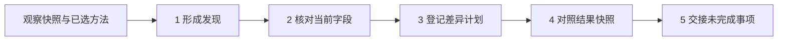

# 一轮投放巡检：从数据到待办交接

[English](README.md) · [项目首页](../README.zh-CN.md) · [如何从零搭建](../docs/build-from-zero.zh-CN.md)

这份 demo 用一个完整例子说明：**投手给出业务目标和已采用的方法，Agent 整理数据、提出有依据的动作、核对变更条件，最后把结果和未完成事项交回给人。**

流程参考了维护者在其他 Agent 中使用的投放工作方式。这里公开的是用**虚构账户和预置快照**重现的离线样例，不是原始实盘日志，也没有调用广告平台。

| 你想先看什么 | 入口 |
|---|---|
| 了解日常怎么工作 | 按下面的五步走读 |
| 直接看一次输出 | [报告样例（中文）](expected/report.md) · [机器可读摘要](expected/summary.json) |
| 在电脑上复现 | 在仓库根目录运行 `python3 demo/run_demo.py --steps` |
| 了解模块怎样搭起来、方法怎样改进 | [从实际工作到可复用 Agent](../docs/build-from-zero.zh-CN.md) |

## 先看人与 Agent 怎样分工

投手负责业务目标、方法选择、预算边界，以及是否采用调整建议。Agent 负责按这些条件整理证据、形成差异计划、核对结果和保留记录。

在接入真实账户的工作方式里，发布或修改还需要对应授权、平台调用与独立读回。本 demo 只演示其中能离线复验的部分：读取文件、按方法判定、比较字段、登记事件和生成报告。`ready` 仅表示当前字段比较通过，不代表用户已批准操作。



实际使用时，人先审阅计划并给出授权，连接器才能执行；本样例的第 3 步只登记计划，第 4 步读取预先准备的结果文件。

## 本轮拿到了哪些输入

场景是检查一组已有投放，回答：“哪些值得调整，哪些还需要证据？”初始化接入和业务访谈不在这一轮里；开始工作前应已按[首次配置引导](../docs/first-run.zh-CN.md)明确范围和方法。

| 输入 | 本例内容 | 用途 |
|---|---|---|
| 观察快照 | 3 个虚构 Meta 账户，共 10 个广告组；账户 C 没有广告组记录 | 保存账户状态与广告组指标 |
| 观察口径 | 快照截止 2026-09-24 11:50（UTC+8）；广告组观察窗口为 9 月 23 日完整投放日 | 说明数字属于哪个时间窗口 |
| 方法文件 | `reference-1n1-ladder`，包含目标 ROAS、样本条件、预算阶梯和止损规则 | 给这一轮提供显式判据 |
| 写前快照 | 同一对象在拟调整前的字段值 | 检查目标是否已经满足、字段是否变化或缺失 |
| 后置快照 | 人工预置的结果字段 | 演示怎样区分目标匹配与不匹配 |
| 结算表 | 独立的收入与成本样例 | 在报告中并列展示结算口径，不把它直接当成当前投放指标 |

输入文件在 [`examples/operating/`](../examples/operating/)。账户健康信号使用快照的 `today_spend`，广告组判据使用已声明观察窗口，结算表有自己的日期；这三类数字不能当成同一张实时表直接相加。

本例使用的 **85% ROAS、1n1、T 阶梯、3T 止损及展示门槛都属于这份示例方法**，不是推荐给所有业务的默认投法。T 表示这份方法计算的目标单次转化成本，不能直接替代所有 App、电商或获客业务的目标。

## 五步走完一轮

### 1. 形成发现：分别记录问题、候选动作与证据缺口

**输入：**观察快照和方法文件。**Agent 做的事：**计算可计算的指标，分别检查账户健康、素材信号和广告组条件。**输出：**`findings.json`，包含 16 条发现、涉及 12 种规则代码。

16 条发现来自账户、广告组和素材三个层级，不代表 16 个广告组，也不代表 16 次操作。同一广告组可以同时出现素材问题和预算建议，仍需人结合上下文判断。

用三个对象看懂这个阶段（下文省略 ID 的 `fictional-adset-` 前缀）：

| 对象 | 观察到什么 | 本方法给出的判断 |
|---|---|---|
| `a2` | 花费 3.10，180 次展示，0 转化 | 样本不足，继续保留未知，不能据此认定素材无效 |
| `a3` | 花费 15.30，420 次展示，0 转化 | 达到本例的零转化止损条件，形成暂停候选 |
| `a5` | CPA 1.60，但预算利用率只有 32% | 先检查投放不足，不因低 CPA 就直接增加预算 |

账户与素材检查可以产生并行发现；广告组主判据有自己的检查顺序。不能把整个系统理解为“七道关卡只选一个结论”。每条发现附有证据、观察窗口、验收说明和停止条件；这些说明供审阅，不会自动变成平台操作。

### 2. 核对当前字段：把建议分成五种状态

**输入：**发现清单和写前快照。**Agent 做的事：**比较计划产生时的基线、期望目标和当前字段。**输出：**`gate.json`。

| 状态 | 本例条数 | 如何处理 |
|---|---|---|
| `ready` | 4 | 现值仍与基线一致，纳入待审阅差异计划；尚未取得发布授权 |
| `satisfied` | 1 | 当前已是目标值，本轮不重复安排相同变更 |
| `conflict` | 1 | 当前既不是基线也不是目标，保留冲突并核对来源 |
| `unknown` | 1 | 缺少对象或必要字段，先补读 |
| `advisory` | 9 | 没有可提交的字段差异，保留为诊断或人工待判断事项 |

例如：`a3` 虽触发暂停建议，但写前快照已经是暂停状态，所以不再安排重复变更；`a9` 的预算为 30，既不是基线 10，也不是目标 20，所以隔离该条。**字段不一致本身不能证明一定是某个人改过。**

### 3. 登记差异计划：明确拟改哪些字段

**输入：**通过字段比较的 4 条记录。**Agent 做的事：**保存最小差异和事件记录。**输出：**`application.json` 与只追加的 `ledger.jsonl`。

| 对象 | 拟调整内容 |
|---|---|
| `a1` | `daily_budget` → `20.00` |
| `a4` | `status` → `PAUSED` |
| `a6` | `daily_budget` → `40.00` |
| `a8` | `status` → `PAUSED` |

本地 `apply` 命令在这里**只登记计划，没有发送请求或修改账户**。真实接入还需要审阅、授权、原生字段映射、失败处理和平台读回，不能只把这个函数替换成一次接口调用就认为上线完成。

### 4. 对照结果快照：目标值有没有匹配

**输入：**差异计划和预置的后置快照。**Agent 做的事：**逐项比较目标字段。**输出：**`reconciliation.json`。

本例检查 4 条：**3 条匹配，1 条不匹配。** `a6` 的预算目标是 40.00，后置快照仍为 20.00，因此保留待核对状态，不能假定完成后继续推进。

这里证明的是比较逻辑能识别差异。由于没有真实写入，不能把“样例字段匹配”描述成“广告修改已经生效”；即使未来真实配置读回一致，也需要另看投放和经营结果。

### 5. 交接：把本轮结论与下一轮待办放在一起

**输入：**发现、字段比较结果、结果核对和事件记录。**Agent 做的事：**生成报告，列出需要补查的对象。**输出：**`report.md` 以及 `open` 命令返回的记录。

除完整发现清单外，本例有三项需要明确跟进的问题：

| 对象 | 当前问题 | 下一步 |
|---|---|---|
| `a9` | 写前预算与基线、目标都不一致 | 核对变化来源，重新判断是否仍需调整 |
| `b1` | 缺少写前状态 | 补读后重新检查 |
| `a6` | 后置快照不符合目标 | 查明差异，取得新证据后再判断 |

其中，`open` 返回 **1 条**，只包含已登记计划但结果未匹配的 `a6`；另外两项保留在字段比较结果里。**不能把 `open_rows=1` 当成本轮只有一个待办。** 当前 CLI 不会自动调度下一轮，宿主需要同时查看这两类记录；9 条仅建议项也继续留在报告中供判断，不表示已经解决。

## 怎样复现

从仓库根目录运行，需要 Python 3.9+，不需要广告账户或 API 密钥。当前命令讲解与生成报告为中文；本目录另有独立的英文走读。

```bash
python3 demo/run_demo.py --steps    # 按上面的五步展开
python3 demo/run_demo.py            # 直接生成并打印整轮报告
python3 demo/run_demo.py --check    # 核对已提交样例与重新计算结果是否一致
```

默认输出在被 Git 忽略的 `demo/out/`。另开一次演示可使用 `--out runs/my-demo`；不同任务使用不同目录。`--steps` 保存分步产物，并在 `full/` 中用同一批样例输入独立生成汇总报告，这不是自动开始下一次投放巡检。

维护者修改展示或逻辑后，可以执行 `python3 demo/run_demo.py --refresh` 更新 `expected/`，审阅差异后再提交。它重新运行的是离线样例，不是平台回放。

## 怎样迁移到自己的工作流

先确定产品、平台、账户、观察窗口、指标定义和用户采用的方法，再准备有来源的快照。阈值调整要通过方法文件记录；新增条件或新平台对象结构可能还需要修改并验证对应规则与适配器。不能把这份 Meta 示例直接当成已验证的 TikTok 或 Google Ads 操作方案。

运行中的纠正可以沉淀为带范围和证据的经验候选，由用户决定是否采用到下一版方法。当前 demo 不会自动训练模型、改阈值或把一次结果晋升为通用知识。

- 了解搭建顺序与方法演进：[从实际工作到可复用 Agent](../docs/build-from-zero.zh-CN.md)。
- 查看字段、计算与命令规范：[投放巡检循环](../docs/operating-loop.zh-CN.md)。
- 查看两类素材测试方法：[方法确认与测试计划](../docs/method-planning.zh-CN.md)。

这几条工作流可以共享业务背景，但当前的投放巡检方法文件与素材测试 MethodSpec 是不同格式，不会自动互相转换。
