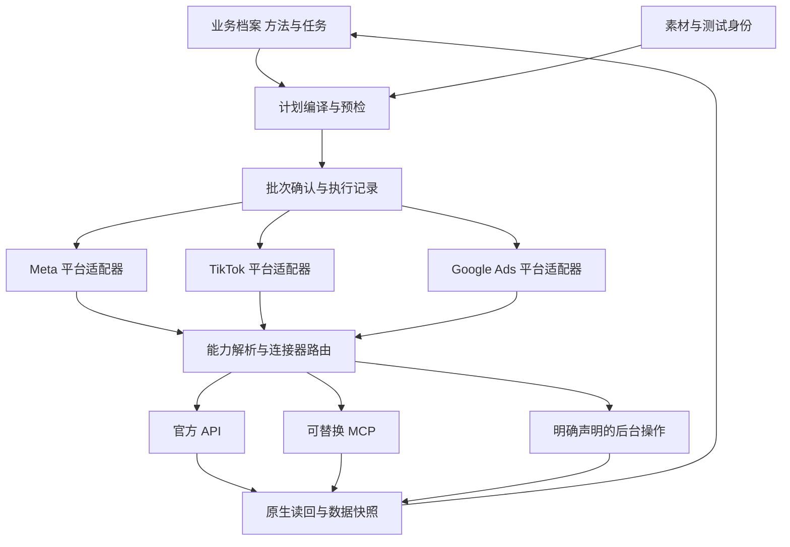

# 架构与实现边界

架构分开三类职责：模型理解任务并提出候选；确定性规则校验范围、字段、预算与依赖；执行器按确认后的计划操作并核对结果。模型说“已经准备好”不能替代规则检查，工具回包成功也不能替代对象读回。

## 当前离线运行时

| 能力 | 当前已经实现 | 尚未实现 |
|---|---|---|
| 业务上下文 | 输入 `facts` 的 value/status/source，检查字段与工作流依赖 | 自动读产品资料、自然语言答案提取、事实真实性核验、独立偏好/作用域模型 |
| 连接状态 | 校验人工提供的模拟快照、scope、时间和 TTL | API/MCP 连接、真实权限探测、认证、机器待办执行 |
| 问题与 readiness | 四类固定工作流，最多三个新问题，按字段 key 记录提问进度 | 自适应七阶段对话、语义去重、自动解决业务冲突 |
| 素材选择 | 按显式标签、类型、语言、尺寸筛选，依输入顺序选取并解释排除 | 打开或下载素材、视频/OCR 理解、版权核验、质量或效果排序 |
| 计划 | 简报快照、候选元数据 hash、素材筛选结果、逻辑操作、预算检查、上下文与计划 hash、批次审阅文件 | 真实广告产品字段编译、完整测试变体设计、平台预检 |
| 授权 | 测试授权 JSON 绑定计划 hash，核对账户、动作、币种、周期及额度 | 真实用户确认、身份认证、签名、到期撤销及生产审计 |
| 执行与恢复 | SQLite 模拟对象、事件、读回和同一 state 内的续跑核对 | 平台发布、网络超时恢复、分布式并发、跨 state 全局幂等 |
| 数据结果 | 本地模拟配置一致性结果 | 真实花费、审核、展示、转化、收入、调度与监控 |

Meta、TikTok、Google 在当前运行时中只是平台标签，均仅接受 `generic_draft`，`native_payload` 为 `null`。`completed_simulation` 表示本地读回符合逻辑计划，不代表已经创建、过审或投放广告。live 模式被拒绝。运行方法以 [根 README](../README.md) 为准。

## 目标组件

平台适配器负责广告对象、优化目标、预算单位、身份、审核和报告语义。连接器负责传输、工具 schema、包装 ID、分页、错误与能力发现。Pipeboard 可以是其中一个 MCP 实现，公共任务与业务档案不依赖其工具名、端口、认证方式或批量限制。

同一平台原生资源用 `platform + account + object_type + native_id` 识别。连接器包装 ID 另存；切换入口不会生成一个新的业务对象。超时后改用另一个连接器，也应先核对前次写入是否已经发生。[连接器契约](../contracts/connector-contract.json)

## 保留平台差异

Meta 的 media/creative/ad/post 不能压成一个素材 ID；TikTok 标准、Smart+、Spark 应有产品分支；Google Search、Demand Gen、PMax 的资源图与素材组合各不相同。公共逻辑只统一任务、资产谱系、预算表达、授权范围、执行状态和证据，不强制共用 campaign/adset/ad 三层结构。

能力声明应细到操作，并附平台产品、账户范围、API/连接器版本、来源及验证时间。例如“能读取广告”与“能为该账户上传媒体并查询处理状态”是两项能力。未知与不支持分别返回，不因一个 MCP 缺方法就认定平台没有该能力。[实操能力映射](operations.md#实现时的最小连接器能力映射)

## 公共逻辑对象

| 对象 | 职责 |
|---|---|
| BusinessContext | 有来源和作用范围的业务事实、方法、未知与冲突 |
| Task / Brief | 本次目标、账户、产品、事件、市场、预算、时间与固定项 |
| Asset / Variant | 原件、内容变体、版位派生、技术规格和平台媒体映射 |
| TestPlan | 问题、变量、固定项、分配、观察窗和可比性 |
| ExecutionPlan | 计划版本、内容 hash、依赖步骤、预期配置与确认范围 |
| Receipt / Operation | 请求和尝试身份、原生对象、结果分类与恢复证据 |
| Readback / Snapshot | 实际配置、状态、时间、覆盖、差异和数据成熟度 |

这些是目标设计中的逻辑职责，不意味着当前代码已经具有七个完整模型。当前实现使用 JSON 与本地 SQLite；无需为了匹配表格而先建立七套服务或数据库。

## 冻结、确认与中断恢复

目标产品将业务理解确认与具体批次发布确认分开。先准备一份具体可审阅的计划，再一次确认其对象、预算与动作范围；计划内步骤自动继续，实质变化生成新差异。创建平台草稿/暂停对象也是外部写入，应包含在相应授权范围。

当前离线机制包括：

1. 对除 `plan_hash` 自身外的完整 canonical JSON 计算 SHA-256。
2. 绑定档案版本与内容 hash，执行前重新读取源档案并计算 readiness。
3. 将账户、创建/读回动作、币种、周期与额度写入模拟授权。
4. 一个 state 目录绑定一份冻结计划，以稳定 operation ID 核对本地模拟对象。
5. 续跑先读回已有对象，包括已 verified 的对象；无法核对或配置漂移则阻断，不盲目再建。

hash 用于内容一致性，不是数字签名。模拟授权不认证批准者，也不构成实际花费授权。同一 state 的唯一约束不保证跨进程、跨目录或真实平台 exactly-once。生产接入必须根据原生幂等能力、可靠回执、并发控制与用户确认机制补齐这些保证。

当前档案 hash 采用保守整体失效：除提问进度字段外的内容变化，包括连接快照更新，都可能使旧计划失效。目标是按实际依赖字段失效；尚未实现。不要为了续跑简单重算旧授权，应重新准备并审阅变更后的计划。

## 数据与金额

金额需保留原始值、规范值、币种、周期与字段单位依据；按唯一预算 owner 汇总，不重复计算共享预算。单位契约应包括平台、endpoint、field、currency 与连接器版本，不能统一乘除 100。

当前运行时只用 Decimal 校验 `total` 预算及本批分配，不换汇、不读取实际消耗，也没有跨任务预算账本。平台真实日预算、总预算和实际节奏由后续适配器分别实现。

报告把真实零、缺失、不可用、未知和无定义分母分开。零转化 CPA 不能填为 0；跨平台各自归因的结果不能直接作为去重用户数。只有可验证的原始字段进入事实表，后续回补保留 as-of 快照。

## 契约文件与执行代码的关系

| 文件 | 用途 | 当前是否被运行时加载 |
|---|---|---|
| [connector-contract.json](../contracts/connector-contract.json) | 可替换连接器与能力映射 | 否，生产接入设计 |
| [creative-recovery.json](../contracts/creative-recovery.json) | 条件化素材恢复动作及证据 | 否，流程设计 |
| [acceptance-scenarios.json](../contracts/acceptance-scenarios.json) | 未来接入和恢复验收场景 | 否，不等于已运行测试 |
| [experience-catalog.json](../contracts/experience-catalog.json) | 分层经验候选 | 否，默认未启用 |
| [onboarding-extensions.json](../contracts/onboarding-extensions.json) | 进一步的业务初始化字段建议 | 否，不能假设当前 CLI 接受全部扩展字段 |

不要把契约中的候选状态、验证示例或官方字段存在，当作当前 runtime 支持真实操作的证明。贡献顺序与验收见 [路线图](roadmap.md)。

返回 [文档索引](index.md)。
