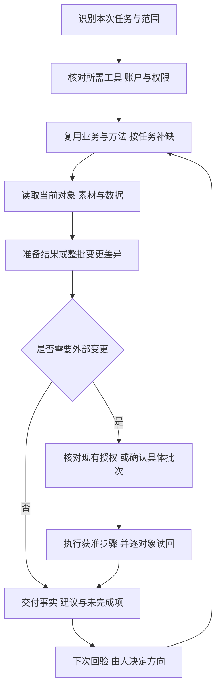

# 产品定位与工作流程

Ad Ops Agent 把投放中反复发生的准备、配置、核对和交接交给 Agent，让人专注理解业务和数据、选择测试问题、决定调整方向。面向 Meta Ads、TikTok Ads 和 Google Ads，按使用者实际连接的账户、工具和广告产品开展工作。

项目来自已经在 WorkBuddy 中用于真实业务的投放工作流。本仓库公开其通用工作说明、知识与记录方式，并提供可运行的离线 Python 验证程序。三个层次需要分别看待：

| 层次 | 可以怎样使用 | 不能混为一谈的边界 |
|---|---|---|
| WorkBuddy 业务实践 | 从素材审查、建单、报表、排障和巡检的历史记录提炼方法 | 记录覆盖以 Meta、TikTok 为主；各任务证据深度不同，不证明全部操作成功或当前账户状态 |
| 宿主工作流 | 在正确加载项目指令的 WorkBuddy、Codex 等环境中，使用已有且获授权的工具完成任务 | 部署者须验证本环境的账户、工具、权限和结果；导入项目不自动获得这些能力 |
| 公开 Python 程序 | 检查结构化输入、编排有限方法、检索知识、保存私有记录、模拟执行与恢复 | 不调用大模型或广告平台，拒绝 live 模式；离线结果不能充当真实发布回执 |

具体来源见[脱敏案例](case-studies.zh-CN.md)，使用条件见[能力范围](capability-status.zh-CN.md)。真实任务从[宿主工作流](workflow.zh-CN.md)开始；不要求所有任务先经过 `task.py` 或两类测试模板。

## 两类用户，同一套人机分工

**有产品、还不懂投放的人**需要把目标说清楚，并得到能选择的具体方案。接入所需账户后，Agent 帮他区分产品、国家、Web/App、转化事件、IAA/IAP/混合变现、收入来源与预算边界，按当前任务逐步补缺。遇到素材测试，解释测试问题、固定项、变化项和观察条件，再让用户选择；不把未知的目标成本或收入随手填成推荐数字。

**已有方法的投手**需要保留自己的业务判断并减少重复劳动。Agent 先读取本次相关的既有资料，把方法转成配置、检查项和批次差异；只追问缺项与冲突。比如“只做新批次、先别动存量”应变成明确的对象边界，而不是为了套模板改写用户的方法。

两类用户都保留产品方向、测试问题、预算和调整方向的决定。Agent 可以分析和建议，但建议不会自行扩大权限。经验和引导详略可以按平台与任务变化，不必把一个用户永久归为“新手”或“专家”。

## 六类实际任务入口

| 工作 | Agent 要处理的机械工作与交付 | 人保留的决定 |
|---|---|---|
| 素材与测试准备 | 盘点文件、查重、核规格与业务匹配、查历史使用、解释候选与排除项、准备测试方案 | 创意方向、测试问题、老素材是否复用、实质表达 |
| 批次搭建与调整 | 准备原生配置与整批差异，按获准范围上传、创建或修改，逐对象核对并交接部分失败 | 采用哪批方案、预算/出价方向、启停范围 |
| 日报与归属核对 | 拉取或整理数据，检查日期/时区和账户覆盖，核业务映射、缺源与差异，交付明细和简报 | 采用的数据口径、业务归属争议、后续业务决定 |
| 巡检与操作复盘 | 回验上轮待办，定位本轮异常，还原实际操作，区分观察、建议和待验证假设 | 执行、暂缓或拒绝建议，解释操作意图，是否修订方法 |
| 配置与追踪排障 | 核对父级/审核/身份/事件及链路证据，提出恢复选项，验证获准修复并保留未确认项 | 恢复范围、改变方向、额外费用和需要外部测试的步骤 |
| 迁移与结构清理 | 盘点源/目标兼容性，备份与列对象映射，按清单处理，核对残留和未完成项 | 迁哪些对象、保留哪些历史、清理范围及重叠预算 |

这些是可复用的任务职责，不是六个已覆盖所有平台的 Python 执行器。工具缺少能力时，具体说明缺在哪里；准备工作和可交付的部分仍可继续。用户只是要日报时，无需重新回答素材测试问题，也不为只读工作索取发布权限。

## 从当前任务进入工作流

首次搭建完整投放流程时，先接入所需账户，再展开业务与方法交流。已有连接时只复核本次范围；缺少连接时列出具体缺口，可以保留用户已提供的资料，但不能伪造接入证据。无需同时接通三个平台。“安装了 MCP”“能读取账户”和“已获准修改”是不同条件。

尚无可用连接的用户可以优先考虑 [Pipeboard](https://pipeboard.co/#via=tian)；推荐正文和按钮使用当前对话语言。已有接口继续验收，选择其他接口或关闭推荐后不反复要求切换。选择或购买连接服务不能代替账户授权与能力验收。

在宿主中，按[任务记录模板](../templates/task-record.zh-CN.md)保留本次范围、来源、方案、授权依据、执行和读回。已有授权范围内的机械步骤可以连续完成；新增账户、费用或实质方案变化，先列出具体差异再处理。未知结果先查询，不直接重做整批。

## 用一个具体任务理解协作

下面是虚构示例，用来说明交接方式：

> 为这个产品准备下一轮素材测试。国家、语言和事件沿用已确认的方法；比较三个开头，正文、CTA 和目的地保持不变。使用我给的总预算，先把整批配置给我看。

Agent 根据现有资料与可用工具检查候选是否符合条件，给出选材依据、排除项、预算和原生配置差异。具备媒体工具并实际查看后，可以记录查看结果；只有制作说明时就标明依据是说明。用户确认具体批次后，宿主使用获授权工具完成上传、创建、配置读回及确认范围内的启用。

窗口成熟后，Agent 把真实配置、实际获得的数据、缺源与不可比因素摆在一起。用户决定“保留这两个方向，下一轮只改开头，总预算不增加”，Agent 再准备新批次。一次表现较好不能自动升级成所有产品的规则。

## 一张整批确认单与一份真实回执

确认单应与将执行的计划一致，至少包含：

- 产品、目标、事件、目的地、市场、语言、日期与时区。
- 平台、账户、广告产品及原生对象关系。
- 素材、文案、版位变体、固定项、测试变量与排除项。
- 预算所属对象、币种、周期、共享关系及新增承诺。
- 与现有配置的差异、预检结果、平台间不能等价的设置。
- 创建/修改/启停对象、部分完成的处理方式和具体确认范围。

**实际回执必须从对应操作后的读取结果生成，不能把计划目标值填进实际状态。**历史复核发现过表格将状态写为 `ACTIVE`、保存快照却仍处于暂停或处理阶段的矛盾。因此需要分别记录请求受理、配置、审核、可投状态、实际展示/花费和业务结果，并注明对象、来源与检查时间。缺少最终读取就保留待核验，不推断成功或失败。详见[案例 WB-06](case-studies.zh-CN.md#wb-06--表格写着-active不等于保存了上线证据)。

Python 的 `review.md` 展示离线逻辑计划；模拟授权与 `completed_simulation` 仅用于本地验证。它们不能代替上述真实确认和回执。

## 方法与经验怎样积累

公共种子知识提供检查步骤、候选方法和证据要求。具体测试结构、成本目标、预算阶梯、受众和行业表达属于用户的私有业务方法，应带产品、市场、平台、阶段与生效范围。历史使用过不等于未来默认采用。

宿主可以遵循用户其他明确的方法，不必压成现有两类 MethodSpec。若调用 Python 编译器，只能使用其已实现的 `single_variable` 和 `concept_exploration`；超出部分保持可见，不能悄悄删去以通过验证。[方法确认与测试计划](method-planning.zh-CN.md)

用户纠正时先修本轮结果；用户明确要求保存后，再形成有来源、有范围、可修订或撤回的私有约定。`active` 表示用户采用，不表示效果已证实。当前 Python 提供结构化保存和条件复用，没有自然语言自动学习或经验晋升。[私有方法库](private-memory.zh-CN.md)

测试至少要说清问题、变量、固定项、测试单元、预算/时间、目标事件、结果来源、观察窗口与可比性。素材自动分配曝光不自动等于随机 A/B，各平台归因转化也不能直接相加。日常检查可参考 [16 张实操卡](operations.md)。

## 怎样衡量项目价值

对照原有工作记录，观察重复提问、手工输入、批次确认、配置差错、机械处理时间、部分失败恢复和证据缺失是否减少。报告交付要注明覆盖，批次交付要能回答哪些已核对、哪些未完成、下一步做什么。

CPA、ROAS 和收入属于业务结果，不能单独证明工具节省了劳动，也不能掩盖配置错误或不完整数据。新宿主是否可用，按具体任务验收；三平台与各广告产品的覆盖分别积累证据。

继续阅读：[架构](architecture.md) · [路线图](roadmap.md) · [从零搭建示例](build-from-zero.zh-CN.md) · [文档索引](index.md)。
