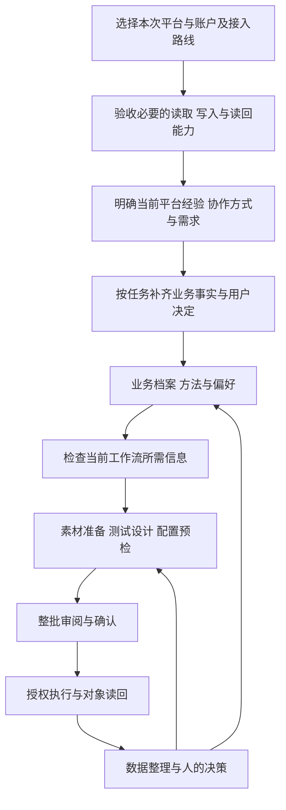

# 产品定位与工作流程

Ad Ops Agent 面向 Meta Ads、TikTok Ads 和 Google Ads 的投放工作：理解产品与方法，整理素材，把已确认的方向变成准确的广告配置、批次操作和可解释结果。投放人员把时间用于理解业务和数据、选择测试问题、决定调整方向。

**当前仓库提供离线 Python 运行时与产品设计，尚未连接真实广告平台。** 运行时可检查结构化档案、筛选素材元数据、生成批次计划并模拟执行与续跑；媒体理解、自然语言交流、真实平台配置与发布是待实现能力。具体边界见 [架构](architecture.md) 和 [路线图](roadmap.md)，运行命令见 [根 README](../README.md)。

## 用户应当怎样工作

下面是目标产品的虚构使用示例，不是当前命令行已经能理解的输入：

> 为这个产品准备下一轮素材测试。国家、语言和事件沿用已确认的方法；比较三个开头，正文、CTA 和目的地保持不变。使用我给的总预算，先把整批配置给我看。

Agent 查找可用素材、去重并准备版位变体，解析目标平台与广告产品，汇总预算和差异。人查看一份完整方案并确认后，Agent 连续完成获准的上传、创建、配置读回和启用；已完成步骤在中断恢复时不重做。

窗口成熟后，Agent 呈现测试问题、真实上线配置、每个版本获得的数据和不可比因素。人可以继续决定：

> 保留这两个方向，下一轮只改开头；总预算不增加。

具体的新批次依照授权规则确认。已有授权范围内的机械步骤和恢复不用逐条重复批准，超范围变化需要明确列出。

## 五类工作入口

| 工作 | Agent 准备和执行 | 人保留的决定 |
|---|---|---|
| 新建投放 | 复用背景、生成简报与平台配置、检查依赖、汇总预算 | 产品、目标、市场、账户及资金边界 |
| 准备与测试素材 | 查找、去重、规格适配、候选理由、测试单元配置 | 创意方向、测试问题、实质表达与权利争议 |
| 执行调整 | 将指定对象和变更转成可预览批次，执行与读回 | 保留/暂停什么，出价和预算调整方向 |
| 查看结果 | 关联素材身份与生效时间，对齐口径，呈现缺数和成熟度 | 解释原因、判断价值、确定下一轮 |
| 处理异常 | 定位媒体、权限、父级状态、配置和数据问题，给出具体恢复选项 | 改变方向、新增费用、超范围授权及政策处理选择 |

AI 可以提出假设与建议，但建议和可执行计划是不同对象。预测某素材可能更好，不自动授予增加预算的权限。项目不以自主搬运预算或自动经营决策作为基础功能。

## 先接入账户，再确定协作方式与业务需求

这是目标产品流程。连接能力是先决条件：本次选定账户具备必要的读取与写入能力后，才展开用户画像和业务提问。没有连接或只有不足以完成操作的只读权限时，只处理接入缺口；业务资料可以暂存。无需同时接入三个平台，也不能把“安装了 MCP”当成账户已经可操作。

连接就绪后再了解用户在当前平台的经验、选择 `guided` 或 `bring_own`、说明当前需求。未确定协作方式或缺少需求时，先给出最多三个相关问题。指导模式使用通俗措辞、收集候选方法所需信息，自带方法模式请求导入或描述方法；当前规则不自动生成方法方案或解析 SOP。平台经验与说明详略作为偏好记录，尚未驱动完整的自动解释层级切换。方法未经用户确认不能自动启用，经验和偏好均不扩大执行权限。

接入向导对尚无可用连接的用户显著推荐 Pipeboard，并在推广入口旁披露佣金关系。已有接口继续验收，选择其他接口或关闭推荐后不反复要求切换。推荐帮助用户选择连接路线，不能代替账户授权或业务方法。

当前离线版本用人工填写的 JSON 档案和虚构连接快照代替真实接入与对话。`connection_gate` 检查声明的接入条件，`guidance` 输出阶段与规则式引导，并生成 `setup.json` / `setup.md`；尚无真实配置流程或 UI。先看[首次配置引导](first-run.zh-CN.md)，业务字段、来源与未知值规则见[业务初始化](onboarding.md)。

## 一张整批确认单

确认单应直接由执行器将使用的同一份计划生成，包含：

- 产品、目标、事件、目的地、市场、语言、日期与时区。
- 目标平台、账户、广告产品及原生对象关系。
- 素材、文案、版位变体、固定项和测试变量。
- 预算所有者、币种、周期、共享关系及新增承诺。
- 与现有配置的差异、预检结果、平台间无法等价的设置。
- 预计创建/修改对象、是否启用、部分上线规则和恢复范围。
- 人确认覆盖的动作及实质变更的处理方式。

当前运行时的 `review.md` 只展示离线逻辑计划，不是真实平台预览或可发送的 API 请求。模拟授权文件也不代表真实用户已经确认广告发布。

## 可选方法，通用执行

投放结构、测试节奏、成本目标、预算阶梯、出价选择和行业表达属于项目方法。它们应带产品、市场、平台、阶段及生效范围，由用户选择或确认；历史使用过不等于未来默认采用。

通用部分负责把方法转成可检查配置、执行步骤和证据。平台不支持用户方法时，说明具体差异和可行选择，不静默改成另一套投法。经验目录提供候选方法和诊断线索，不能自行加载为已启用规则。[经验候选契约](../contracts/experience-catalog.json)

## 素材测试需要回答一个明确问题

测试计划至少定义问题、变量、固定项、测试单元、预算/时间、目标事件、归因/结果来源、观察窗口与可比性。自动分配曝光的素材组合不自动等于随机 A/B；相同字段名也不代表不同平台的转化可以直接相加。

素材库需要区分文件、内容变体、平台媒体、创意、广告及帖子。日常操作见 [16 张实操卡](operations.md)；需要恢复优质素材时，见 [Meta 条件化素材恢复](meta-creative-recovery.md)。

## 如何衡量项目价值

先记录现有工作基线，再测人工输入字段数、重复问题数量、整批确认次数、手工处理时间、配置差错率、执行完成率和恢复成功率。CPA、ROAS、收入属于业务结果，不能单独证明执行工具节省了劳动，也不应被用来掩盖配置错误或不完整数据。

返回 [文档索引](index.md)。
